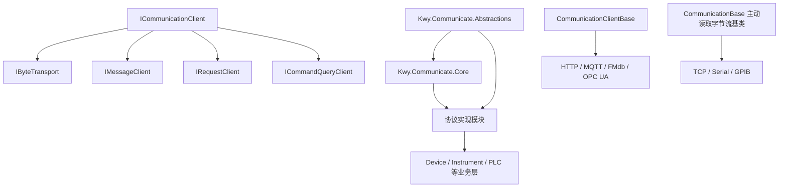

# Kwy.Communicate 通讯层架构与扩展指南

## 1. 本次更新概述

本次更新将 `Kwy.Communicate` 从“所有协议共用一个字节流接口”的设计，调整为“公共生命周期 + 按能力组合接口”的设计。

主要目标：

- 通讯协议只实现自己真正支持的能力。
- 同步 API 不再进入 V2 接口，必要时通过扩展方法提供。
- 协议配置归属各自模块，`Abstractions` 只保留通用契约。
- 统一连接、断开、状态、错误、释放和自动重连行为。
- 避免主动读取、后台读取和底层流读取同时消费同一数据源。
- 为后续增加新通讯协议提供清晰、低耦合的扩展路径。

## 2. 本次更改内容

### 2.1 新增 V2 公共接口

`Kwy.Communicate.Abstractions` 新增以下接口：

| 接口 | 用途 |
| --- | --- |
| `ICommunicationClient` | 所有通讯客户端共有的生命周期、状态和事件 |
| `IByteTransport` | TCP、Serial、GPIB 等主动读写字节流 |
| `IMessageClient<TMessage>` | MQTT 等消息发布与消息流 |
| `IRequestClient<TRequest, TResponse>` | HTTP 等请求响应协议 |
| `ICommandQueryClient` | SCPI、GPIB 等命令查询协议 |
| `ICommunicationFactory` | 线程安全的通讯客户端创建与注册 |

旧的 `ICommunicationProtocol` 已移除。所有业务代码应依赖 `ICommunicationClient` 和协议真正支持的能力接口。

### 2.2 生命周期与重连统一

`Kwy.Communicate.Core` 新增 `CommunicationClientBase`，统一处理：

- `ConnectAsync`、`DisconnectAsync`
- `ConnectionState` 状态变更
- `ConnectionStateChanged`、`ErrorOccurred` 事件
- `Dispose`、`DisposeAsync`
- 自动重连
- 独立的重连 `CancellationTokenSource`
- 单飞重连任务，避免多个重连循环并发执行
- 每次连接和重连前清理旧连接
- 通讯失败后后台触发重连，不阻塞当前失败的读写调用

`CommunicationBase` 作为主动读取字节流基类保留，只实现 `IByteTransport`。

### 2.3 工厂线程安全与泛型创建

`CommunicationFactory` 使用线程安全注册表，并支持：

```csharp
ICommunicationClient CreateClient(IProtocolConfig config);

TCommunication Create<TCommunication, TConfig>(TConfig config)
    where TCommunication : class, ICommunicationClient
    where TConfig : IProtocolConfig;
```

旧的 `CreateProtocol` 和 `RegisterProtocolCreator` 已移除。

### 2.4 协议配置移动到各自模块

协议专属配置不再放在 `Kwy.Communicate.Abstractions` 中。

| 配置 | 所属模块 |
| --- | --- |
| `TcpConfig`、`SerialPortConfig`、`HttpConfig` | `Kwy.Communicate.TcpSerial` |
| `MqttConfig` | `Kwy.Communicate.Mqtt` |
| `MdbConfig` | `Kwy.Communicate.FMdb` |
| `GpibConfig` | `Kwy.Communicate.NI` |
| `OpcUaConfig` | `Kwy.Communicate.OpcUa` |

`Abstractions` 只保留 `IProtocolConfig` 和通用重连参数约定。

### 2.5 配置验证增强

保留现有 `IProtocolConfig.Validate()`，同时提供：

```csharp
ConfigurationValidationResult result = config.ValidateDetailed();
config.ValidateAndThrow();
```

当前通用 `ValidateDetailed()` 会将 `Validate()` 的失败转换为验证结果。协议模块后续可根据需要提供更详细的专属验证扩展。

### 2.6 接收模式明确

每个通讯实现必须选择一种接收方式：

- 主动读取：调用 `IByteTransport.ReadAsync`
- 消息流：订阅 `MessageReceived` 或枚举 `ReadMessagesAsync`

同一底层数据源不能同时被后台接收循环、主动读取 API 和外部底层流直接读取。

### 2.7 已迁移模块

| 模块 | 当前能力 |
| --- | --- |
| TCP | `IByteTransport`，主动读取 |
| Serial | `IByteTransport`，主动读取 |
| HTTP | `IRequestClient<HttpRequestMessage, HttpResponseMessage>` |
| MQTT | `IMqttCommunication`、`IMessageClient<MqttMessage>` |
| FMdb | `ICommunicationFMdb`，异步 Modbus 操作 |
| GPIB | `IByteTransport`、`ICommandQueryClient` |
| OPC UA | `CommunicationClientBase`，节点读写与订阅 |

同时修复了以下运行时问题：

- `Dispose` 先标记已释放，导致连接没有真正断开。
- TCP 接收任务在连接状态尚未完成时提前退出。
- MQTT 首次订阅在连接成功前执行，导致订阅失败。
- TCP、Serial 存在多个消费者读取同一数据源的风险。
- 重连任务可能重复启动，且重连前没有统一清理旧连接。
- MQTT 消息接收丢失 Topic、QoS、Retain 等元数据。

## 3. 当前架构



### 3.1 Abstractions

职责：

- 定义公共生命周期和能力接口。
- 定义连接状态、错误事件和通用配置契约。
- 提供同步或文本便利扩展方法。
- 不引用任何具体协议实现或第三方通讯库。

不应放入：

- MQTT、Modbus、OPC UA、TCP 等协议专属配置。
- 第三方库类型。
- 协议实现代码。

### 3.2 Core

职责：

- 实现通讯生命周期基类。
- 实现状态管理、释放和自动重连。
- 提供线程安全的 `CommunicationFactory`。
- 提供主动读取字节流基类。

### 3.3 协议实现模块

职责：

- 定义协议专属配置、消息模型和专属接口。
- 引用需要的第三方通讯库。
- 选择并实现一个或多个能力接口。
- 提供工厂注册扩展方法。

### 3.4 业务层

业务层应依赖能力接口，而不是依赖一个包含所有协议方法的“大接口”。

示例：

```csharp
public sealed class InstrumentService
{
    private readonly ICommunicationClient client;
    private readonly IByteTransport transport;

    public InstrumentService(ICommunicationClient client)
    {
        this.client = client;
        transport = client as IByteTransport
            ?? throw new ArgumentException("Instrument communication must support IByteTransport.", nameof(client));
    }

    public async Task<string> QueryAsync(string command, CancellationToken cancellationToken = default)
    {
        await client.ConnectAsync(cancellationToken);
        await transport.WriteTextAsync(command, cancellationToken: cancellationToken);

        var buffer = new byte[4096];
        var length = await transport.ReadAsync(buffer, cancellationToken);
        return System.Text.Encoding.UTF8.GetString(buffer, 0, length);
    }
}
```

## 4. 能力接口选择

新增通讯协议时，先判断协议的真实交互模型。

| 交互模型 | 推荐接口 | 示例 |
| --- | --- | --- |
| 连续字节流，调用方主动读取 | `IByteTransport` | TCP、Serial |
| 发布、订阅、消息推送 | `IMessageClient<TMessage>` | MQTT |
| 一次请求对应一次响应 | `IRequestClient<TRequest, TResponse>` | HTTP |
| 文本命令与查询响应 | `ICommandQueryClient` | GPIB、SCPI |
| 协议有明确领域操作 | 专属接口继承 `ICommunicationClient` | Modbus、OPC UA |

不要为了“统一”而让协议实现不支持的能力。例如：

- MQTT 不应实现底层 `ReadAsync`。
- HTTP 不应实现 `ReceiveBatchAsync`。
- Modbus 不应暴露原始底层流给业务层。
- OPC UA 不应伪装成字节流协议。

## 5. 使用方式

### 5.1 注册通讯模块

各协议模块通过扩展方法注册自身配置和实现：

```csharp
var factory = new CommunicationFactory()
    .RegisterTcpSerialClients()
    .RegisterMqtt()
    .RegisterFluentModbus()
    .RegisterGpib();
```

OPC UA 需要注入 `ISessionFactory`：

```csharp
factory.RegisterOpcUa(sessionFactory);
```

### 5.2 创建通用客户端

```csharp
var config = new TcpConfig
{
    Host = "127.0.0.1",
    Port = 502
};

ICommunicationClient client = factory.CreateClient(config);
await client.ConnectAsync();
```

### 5.3 泛型创建并获取能力

```csharp
var tcp = factory.Create<TcpCommunication, TcpConfig>(config);
IByteTransport transport = tcp;

await transport.WriteTextAsync("HELLO");
var buffer = new byte[1024];
var length = await transport.ReadAsync(buffer);
```

### 5.4 MQTT 消息流

```csharp
var mqtt = factory.Create<MqttCommunication, MqttConfig>(mqttConfig);
await mqtt.ConnectAsync();
await mqtt.SubscribeAsync(new[] { "factory/line1/status" });

await foreach (var message in mqtt.ReadMessagesAsync(cancellationToken))
{
    Console.WriteLine($"{message.Topic}: {message.Payload.Length} bytes");
}
```

### 5.5 FMdb 异步 API

```csharp
ICommunicationFMdb modbus =
    factory.Create<FMdbCommunication, MdbConfig>(modbusConfig);

await modbus.ConnectAsync();
var registers = await modbus.ReadHoldingRegistersAsync<ushort>(0, 10);
```

同步调用仅作为扩展方法提供，建议新代码优先使用异步 API：

```csharp
var registers = modbus.ReadHoldingRegisters<ushort>(0, 10);
```

## 6. 如何新增通讯模块

以下以新增 `Kwy.Communicate.Example` 为例。

### 6.1 创建独立项目

项目应至少引用：

```xml
<ProjectReference Include="..\Kwy.Communicate.Abstractions\Kwy.Communicate.Abstractions.csproj" />
<ProjectReference Include="..\Kwy.Communicate.Core\Kwy.Communicate.Core.csproj" />
```

第三方协议库只应由该协议模块引用。

### 6.2 定义协议配置

配置放在新模块中，不要放入 `Abstractions`。

先在 `ProtocolType` 中增加明确的协议类型：

```csharp
public enum ProtocolType
{
    // Existing protocol types...
    Example
}
```

```csharp
using Kwy.Communicate.Abstractions;
using Kwy.Communicate.Abstractions.Enums;

namespace Kwy.Communicate.Example;

public sealed class ExampleConfig : IProtocolConfig
{
    public ProtocolType ProtocolType => ProtocolType.Example;
    public string Endpoint { get; set; } = string.Empty;
    public int Timeout { get; set; } = 5000;
    public bool AutoReconnect { get; set; } = true;
    public int MaxReconnectAttempts { get; set; } = 5;
    public int ReconnectInterval { get; set; } = 1000;

    public bool Validate()
        => !string.IsNullOrWhiteSpace(Endpoint)
           && Timeout > 0
           && MaxReconnectAttempts >= 0
           && ReconnectInterval >= 0;
}
```

### 6.3 选择能力接口

如果协议是消息协议：

```csharp
public sealed record ExampleMessage(string Topic, ReadOnlyMemory<byte> Payload);

public interface IExampleCommunication : IMessageClient<ExampleMessage>
{
    Task SubscribeAsync(string topic, CancellationToken cancellationToken = default);
}
```

如果协议是领域协议，例如 PLC、数据库或工业协议，应定义专属接口：

```csharp
public interface IExampleCommunication : ICommunicationClient
{
    Task<int> ReadValueAsync(string address, CancellationToken cancellationToken = default);
    Task WriteValueAsync(string address, int value, CancellationToken cancellationToken = default);
}
```

### 6.4 实现通讯客户端

优先继承 `CommunicationClientBase`：

```csharp
using Kwy.Communicate.Core;

namespace Kwy.Communicate.Example;

public sealed class ExampleCommunication : CommunicationClientBase, IExampleCommunication
{
    private readonly ExampleConfig exampleConfig;
    private ThirdPartyClient? client;

    public ExampleCommunication(ExampleConfig config) : base(config)
    {
        exampleConfig = config ?? throw new ArgumentNullException(nameof(config));
    }

    protected override async Task ConnectCoreAsync(CancellationToken cancellationToken)
    {
        client = new ThirdPartyClient(exampleConfig.Endpoint);
        await client.ConnectAsync(cancellationToken);
    }

    protected override async Task DisconnectCoreAsync(CancellationToken cancellationToken)
    {
        if (client == null)
            return;

        await client.DisconnectAsync(cancellationToken);
        client.Dispose();
        client = null;
    }

    protected override bool IsConnectionAlive()
        => client?.IsConnected == true;

    public async Task<int> ReadValueAsync(string address, CancellationToken cancellationToken = default)
    {
        ThrowIfDisposed();
        if (!IsConnected || client == null)
            throw new InvalidOperationException("Example client is not connected.");

        try
        {
            return await client.ReadValueAsync(address, cancellationToken);
        }
        catch (Exception ex) when (ex is not OperationCanceledException)
        {
            await HandleCommunicationFailureAsync(ex, $"Read failed: {ex.Message}");
            throw;
        }
    }
}
```

实现要求：

- `ConnectCoreAsync` 只负责建立底层连接。
- `DisconnectCoreAsync` 必须释放所有底层连接和事件订阅。
- `IsConnectionAlive` 应真实反映底层连接状态。
- 通讯失败时调用 `HandleCommunicationFailureAsync`。
- 不要自行启动第二套自动重连循环。
- 不要在同一底层数据源上同时提供主动读取和后台消息消费。

### 6.5 提供工厂注册扩展

```csharp
using Kwy.Communicate.Abstractions;

namespace Kwy.Communicate.Example;

public static class CommunicationFactoryExtensions
{
    public static ICommunicationFactory RegisterExample(this ICommunicationFactory factory)
    {
        ArgumentNullException.ThrowIfNull(factory);
        factory.RegisterCreator<ExampleConfig>(config => new ExampleCommunication(config));
        return factory;
    }
}
```

使用：

```csharp
var factory = new CommunicationFactory()
    .RegisterExample();

var client = factory.Create<ExampleCommunication, ExampleConfig>(config);
```

### 6.6 提供同步便利方法

V2 接口中不要加入同步 API。确实需要同步调用时，通过扩展方法提供：

```csharp
public static class ExampleCommunicationExtensions
{
    public static int ReadValue(this IExampleCommunication client, string address)
        => client.ReadValueAsync(address).GetAwaiter().GetResult();
}
```

### 6.7 验证清单

新增模块完成后至少验证：

- 配置无效时能在连接前失败。
- 连接、断开和重复断开行为正确。
- `Dispose` 和 `DisposeAsync` 会释放底层资源。
- 通讯失败只启动一个重连任务。
- 重连前旧连接已清理。
- 主动断开不会触发自动重连。
- 事件订阅在重连后正确恢复。
- 接收数据只有一个消费者。
- 项目在所有目标框架下 `0 warning / 0 error`。

## 7. V2-only API

通讯层已经移除旧兼容 API，包括：

- `ICommunicationProtocol`
- `CommunicationFactory.CreateProtocol`
- `CommunicationFactory.RegisterProtocolCreator`
- 通讯实现中的 `SendData`、`SendString`、`Receive`、`ReceiveBatchAsync`
- HTTP 的 `SendRequestAsync`
- GPIB 的 `SendCommandAsync`、`ReceiveResponseAsync`
- 独立的 `ReconnectionHandler`

统一使用以下 V2 API：

| 场景 | V2 API |
| --- | --- |
| 通讯生命周期 | `ICommunicationClient` |
| 字节发送 | `IByteTransport.WriteAsync` |
| 文本发送 | `IByteTransport.WriteTextAsync` |
| 主动读取 | `IByteTransport.ReadAsync` |
| 消息接收 | `IMessageClient<T>.MessageReceived` 或 `ReadMessagesAsync` |
| 创建客户端 | `CreateClient` 或 `Create<TCommunication, TConfig>` |
| 自动重连 | `CommunicationClientBase` |

## 8. 设计原则

后续维护 `Kwy.Communicate` 时遵循以下原则：

1. `Abstractions` 只定义稳定、通用、无第三方依赖的契约。
2. 协议专属配置、消息模型和第三方库放在各自模块。
3. 接口表达能力，不表达并非所有协议都支持的实现细节。
4. V2 接口异步优先，同步调用通过扩展方法提供。
5. 一个底层接收源只能有一个消费者。
6. 自动重连统一交给 `CommunicationClientBase`。
7. 业务层依赖能力接口，不依赖具体通讯库。
8. 新协议必须提供工厂注册扩展和构建验证。
9. 不得重新引入旧兼容 API 或 `[Obsolete]` 迁移成员。
## 9. KeepAlive 与重连策略

通信层的重连由 `Kwy.Communicate.Core.CommunicationClientBase` 统一管理。协议实现只需要在发现链路异常时调用 `HandleCommunicationFailureAsync()`，基类会负责状态切换、单飞重连、重连前断开旧连接以及恢复连接后的 `OnConnectedAsync()`。

`HandleCommunicationFailureAsync()` 只负责记录错误、切换状态并启动后台重连任务。它不会等待完整重连流程结束，因此一次 `ReadAsync` 或 `WriteAsync` 失败会尽快把异常返回给调用方，恢复过程由后台单飞任务继续执行。

`ConnectAsync()` 也保持“一次连接尝试”的语义。首次连接失败时，如果 `AutoReconnect = true`，通信层会后台启动重连任务，但仍然把本次连接失败异常抛给调用方。这样设备层和整机状态机可以明确感知首次连接失败，并决定进入 `Error`、`Recovering` 或 `ManualInterventionRequired`，不会被通信层的自动重连吞掉关键状态。

`IKeepAliveConfig` 是可选能力接口，不属于 `IProtocolConfig` 的必选成员。这样可以让需要主动健康检查的协议接入 KeepAlive，而 MQTT、OPC UA 这类已经有协议级心跳和订阅恢复机制的模块继续使用自己的机制。

当前策略：

| 模块 | 健康检查/重连策略 |
| --- | --- |
| TCP | `TcpConfig` 实现 `IKeepAliveConfig`。连接后启用 Socket KeepAlive，并由基类定时检查 Socket/Stream 状态和远端半关闭。I/O 失败或 KeepAlive 失败都会进入统一重连。 |
| Serial | `SerialPortConfig` 实现 `IKeepAliveConfig`。基类定时检查串口是否仍打开；`SerialPort.ErrorReceived` 会触发统一重连。 |
| GPIB | `GpibConfig` 实现 `IKeepAliveConfig`。默认只检查本地 NI4882 会话是否存在；如果配置 `KeepAliveCommand`，会通过仪表命令/查询主动验证链路，失败后进入统一重连。 |
| HTTP | 默认 `AutoReconnect = false` 是合理的。HTTP 通常是短请求模型，失败由请求方按业务策略重试。 |
| MQTT | 使用 MQTT 协议 KeepAlive 和断线事件。重连成功后恢复订阅。 |
| OPC UA | 使用 OPC UA Session KeepAlive。重连成功后恢复订阅。 |

GPIB 的 `KeepAliveCommand` 需要由业务根据具体仪表选择，例如支持 SCPI 的仪表可以配置 `*STB?` 或设备专用状态查询命令。框架默认不发送探测命令，是为了避免通用库擅自改变仪表状态或污染读写缓冲。

## 10. 预留模块状态

当前仓库中存在若干预留通信模块：

| 模块 | 当前状态 | 建议 |
| --- | --- | --- |
| `Kwy.Communicate.Secs` | 已建立基础层 | SECS/HSMS 配置、SECS Message、SecsItem、ISecsClient、内存客户端。后续接 Secs4Net adapter。 |
| `Kwy.Communicate.Gem` | 已建立 E30 行为层 | GEM 通信/控制状态、变量、事件、报告、报警、配方、远程命令。 |
| `Kwy.Communicate.Gem300` | 已建立对象模型层 | Carrier、LoadPort、SlotMap、Substrate、ProcessJob、ControlJob 和内存管理器。 |
| `Kwy.Communicate.Visa` | 预留项目 | 后续用于 VISA 仪器通信。 |

预留项目不应承载临时业务代码。正式实现前建议先补齐对应协议的 `Config`、能力接口、工厂注册扩展、README 和构建验证。

## 11. SECS / GEM / GEM300 分层

半导体通信按三层拆分：

```text
Kwy.Communicate.Secs
  HSMS / SECS-II 基础层
  负责连接配置、SECS 消息、Item 数据结构、事务收发和客户端抽象。

Kwy.Communicate.Secs.Secs4Net
  Secs4Net 适配层
  引用 Secs4Net，实现真实 HSMS/SECS 通信，并适配为 Kwy 的 ISecsClient。

Kwy.Communicate.Gem
  SEMI E30 行为层
  负责 Communication State、Control State、Alarm、Collection Event、Report、Variable、Recipe、Remote Command、Trace、Spooling。

Kwy.Communicate.Gem300
  GEM300 对象模型层
  负责 Carrier、LoadPort、SlotMap、Substrate、ProcessJob、ControlJob 等 300mm 自动化对象。
```

当前 `Secs` 层提供 `InMemorySecsClient`，用于上层 GEM/GEM300 的开发和测试。真实 HSMS 通信由 `Kwy.Communicate.Secs.Secs4Net` 适配器实现 `ISecsClient`，这样上层 GEM/GEM300 不直接依赖第三方库。

当前实现已经提供半导体标准所需的核心对象模型，但不等同于 SEMI 认证。正式项目仍需要根据客户/EAP/MES 的 SML、VID/CEID/RPTID 表、Alarm 表、Recipe 规则和 GEM300 场景进行一致性测试。

Secs4Net 官方说明其提供 SECS-II / HSMS-SS / GEM 的 .NET 实现，安装包为 `Secs4Net`。Kwy 只在适配器项目中引用该包，避免第三方类型泄漏到 GEM/GEM300 上层。
