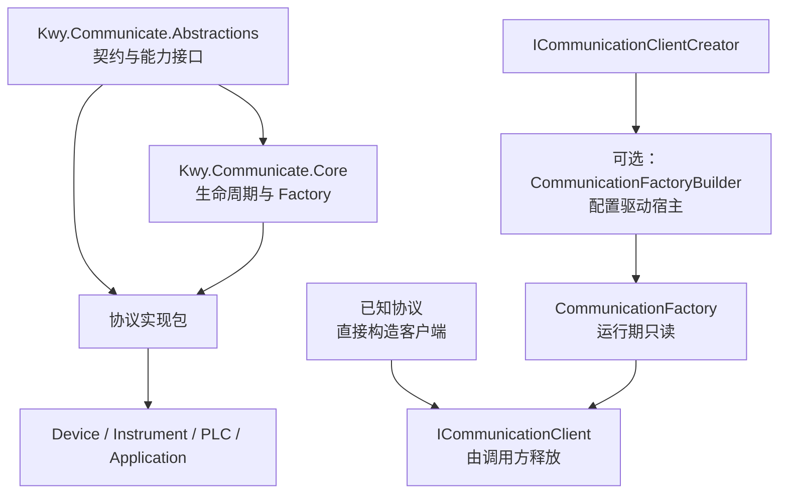

# Kwy.Communicate 通信层架构与扩展指南

## 1. 设计目标

`Kwy.Communicate.*` 为设备、仪器、PLC 和上位系统提供通信基础能力。通信层只处理连接与协议语义，不承担设备业务语义。

长期设计目标：

- 公共生命周期统一，协议能力按接口组合。
- 协议已知时直接创建具体客户端，由调用方拥有并释放实例。
- 仅在运行时根据配置选择协议时，使用统一 Factory 路由创建。
- 协议映射只在启动阶段配置，运行期 Factory 不可变。
- DI 只组装 Creator 及其共享依赖，不接管有限生命周期的通信客户端。
- `Abstractions` 和 `Core` 不依赖 DI 容器，不使用 Service Locator。
- 配置与运行状态分离，不把订阅、缓存等运行状态回写配置。

## 2. 分层与依赖方向


```mermaid
flowchart TD
    A["Kwy.Communicate.Abstractions<br/>契约与能力接口"] --> B["Kwy.Communicate.Core<br/>生命周期与 Factory"]
    A --> C["协议实现包"]
    B --> C
    C --> D["Device / Instrument / PLC / Application"]

    U["已知协议<br/>直接构造客户端"] --> X["ICommunicationClient<br/>由调用方释放"]
    R["可选：CommunicationFactoryBuilder<br/>配置驱动宿主"] --> F["CommunicationFactory<br/>运行期只读"]
    P["ICommunicationClientCreator<TConfig>"] --> R
    F --> X
```

### 2.1 Abstractions

职责：

- 定义 `ICommunicationClient` 公共生命周期。
- 定义按能力拆分的接口。
- 定义 `IProtocolConfig`、连接状态和公共事件。
- 定义 `ICommunicationFactory` 和 `ICommunicationClientCreator<TConfig>` 扩展契约。

不应包含：

- MQTT、Modbus、OPC UA 等协议专属配置。
- 第三方 SDK 类型或协议实现。
- `IServiceCollection`、`IServiceProvider` 等 DI 类型。

### 2.2 Core

职责：

- `CommunicationClientBase`：状态、连接、断开、释放、KeepAlive 和单飞重连。
- `CommunicationBase`：主动读取字节流的通用基类。
- `CommunicationFactoryBuilder`：启动期收集 Creator。
- `CommunicationFactory`：运行期按配置类型创建客户端。

`Core` 不引用 `Microsoft.Extensions.DependencyInjection`，也不保存 `IServiceProvider`。

### 2.3 协议实现包

职责：

- 定义协议专属配置、消息和能力接口。
- 封装第三方 SDK。
- 继承 Core 生命周期基类。
- 提供面向 `CommunicationFactoryBuilder` 的可选启动期注册扩展。
- 有外部依赖时实现 `ICommunicationClientCreator<TConfig>`。

### 2.4 宿主集成

`Kwy.Communicate.Grpc.Service` 可提供 `IServiceCollection` 扩展，因为它本身就是 ASP.NET Core 宿主集成层。`Kwy.Communicate.Gem` 和普通客户端协议包保持容器无关。

`Kwy.Communicate.Gem` 的公共 API 不暴露 DI 类型，项目也不直接引用 `Microsoft.Extensions.DependencyInjection.Abstractions`。但 Secs4Net 使用 `Microsoft.Extensions.Options` / `IOptions<T>`，因此 NuGet 依赖树中仍可能传递出现 DI Abstractions；这是第三方 SDK 实现依赖，不是 Kwy 的容器约束。

普通 TCP、Serial、MQTT、Modbus、GPIB、OPC UA 客户端不应作为根容器 transient disposable 服务注册。

## 3. 生命周期与能力接口

`ICommunicationClient` 统一提供：

- `ConnectAsync()` / `DisconnectAsync()`
- `State` / `IsConnected`
- `ConnectionStateChanged` / `ErrorOccurred`
- `Dispose()` / `DisposeAsync()`

工厂创建的客户端由调用方拥有：

```csharp
await using ICommunicationClient client = factory.CreateClient(config);
await client.ConnectAsync(cancellationToken);
```

Factory 不得暗中缓存或释放已返回的客户端。

| 交互模型 | 接口 | 典型协议 |
| --- | --- | --- |
| 连续字节流，调用方主动读取 | `IByteTransport` | TCP、Serial |
| 发布/订阅和消息推送 | `IMessageClient<TMessage>` | MQTT |
| 一次请求对应一次响应 | `IRequestClient<TRequest,TResponse>` | HTTP |
| 文本命令与查询 | `ICommandQueryClient` | GPIB、SCPI |
| 明确的领域操作 | 专属接口 | Modbus、OPC UA、GEM |

不得为了形式统一而实现协议不支持的能力。

## 4. 创建方式与 Factory

### 4.1 默认：直接创建具体协议客户端

当业务在编译期已知通信协议时，直接使用具体客户端。这是 `Kwy.Communicate` 的首选入口，不需要 Builder、Factory 或 DI。

```csharp
var config = new TcpConfig
{
    Host = "127.0.0.1",
    Port = 502
};

await using var tcp = new TcpCommunication(config);
await tcp.ConnectAsync(cancellationToken);
await tcp.WriteAsync(payload, cancellationToken);
```

同样，MQTT、GPIB、Modbus 等普通客户端均优先通过公开构造函数创建。OPC UA 等需要 SDK Factory 的协议，通过构造函数显式传入该依赖。

### 4.2 可选：Builder、Creator 与统一 Factory

只有当具体协议需要在运行时由 `IProtocolConfig` 决定时，才使用统一 Factory。典型场景是设备目录、JSON/数据库配置加载、插件化协议和多协议设备平台。

| 组件 | 可变性 | 职责 |
| --- | --- | --- |
| `CommunicationFactoryBuilder` | 启动期可变 | 收集 Creator，检查重复映射 |
| `ICommunicationClientCreator<TConfig>` | 通常无状态 | 使用配置和已注入依赖创建一个客户端 |
| `CommunicationFactory` | 运行期不可变 | 验证配置并路由到唯一 Creator |

`ICommunicationFactory` 不再暴露注册方法，业务层无法修改全局映射。

#### 按需组装

```csharp
var builder = new CommunicationFactoryBuilder();
builder.RegisterTcp();
builder.RegisterSerialPort();
builder.RegisterVisa();

ICommunicationFactory factory = builder.Build();
```

只注册当前宿主真正使用的协议。不提供、也不推荐 `RegisterAllCommunications()`。`RegisterTcpSerialClients()` 仅是 TCP、Serial 和 HTTP 都需要时的便利方法；其他场景使用 `RegisterTcp()`、`RegisterSerialPort()` 或 `RegisterHttp()` 精确注册。

`Build()` 后 Builder 不能继续修改或重复构建。同一配置类型注册两次会立即失败。

#### 强类型 Creator

需要证书、SDK Factory、诊断器或其他外部依赖的协议应实现 Creator：

```csharp
public sealed class ExampleClientCreator(
    IExampleSdkFactory sdkFactory)
    : ICommunicationClientCreator<ExampleConfig>
{
    public ICommunicationClient Create(ExampleConfig config)
        => new ExampleCommunication(config, sdkFactory);
}
```

非 DI 环境直接注册 Creator：

```csharp
var builder = new CommunicationFactoryBuilder();
builder.AddCreator(new ExampleClientCreator(sdkFactory));
ICommunicationFactory factory = builder.Build();
```

未来 DI 桥接层可收集 `IEnumerable<ICommunicationClientCreator>` 并构造 `CommunicationFactory`，但 Factory 自身不注入或保存 `IServiceProvider`。

## 5. DI 边界

可以由 DI 管理：

- 不可变、无状态或线程安全的 Creator。
- 证书、凭据、诊断、日志和 SDK Factory。
- 只读 `ICommunicationFactory`。
- ASP.NET Core gRPC 服务端和单端点 GEM 子系统。

不应由根容器作为 transient 管理：

- TCP、Serial、MQTT、OPC UA、Modbus 等 `IDisposable` 客户端。
- 由动态配置临时创建的连接。
- 需在容器作用域结束前主动断开的对象。

禁止：

```csharp
// Factory 变成 Service Locator
public CommunicationFactory(IServiceProvider services);

// 注册期间构建临时容器
services.BuildServiceProvider();

// 根容器长期捕获 transient disposable 连接
services.AddTransient<ICommunicationClient, TcpCommunication>();
```

## 6. 配置与运行状态

`IProtocolConfig` 只描述创建连接的参数，不是运行状态容器。

- Factory 在创建客户端前调用 `ValidateAndThrow()`。
- 内置 TCP、Serial 和 HTTP 客户端在构造时复制配置，不向外暴露运行中的可变配置。
- 协议客户端不得回写配置。
- 集合配置应在构造时复制。
- 新协议优先使用不可变 record/options。

MQTT 的当前订阅集合保存在客户端内部；订阅和取消订阅不会修改 `MqttConfig.SubscribeTopics`。

## 7. HTTP Handler 边界

`HttpCommunication` 通过 `IHttpMessageHandlerFactory` 创建 Handler。

```csharp
builder.RegisterHttp();                     // 默认 Handler
builder.RegisterHttp(customHandlerFactory); // 自定义 Handler
```

自定义工厂可用于测试、代理、客户端证书和宿主集成。如果未来接入 `IHttpClientFactory`，应通过独立适配器实现，不让 TcpSerial 项目强制依赖 DI。

## 8. GEM 与多端点

GEM 通过协议专属的 `SecsGemClientFactory` 创建，不依赖 DI 容器：

```csharp
await using ISecsGemClient client = SecsGemClientFactory.Create(config);
await client.ConnectAsync(cancellationToken);
```

多端点由应用层 Registry/Manager 按稳定 ID 保存客户端并统一释放。宿主如果使用 DI，在应用组合根显式注册已创建的客户端或应用层 Manager；`Kwy.Communicate.Gem` 不提供 `IServiceCollection` 扩展。

## 9. KeepAlive 与重连

`CommunicationClientBase` 统一管理：

- 连接与断开互斥。
- 状态变更与错误事件。
- 单飞重连、指数退避和随机抖动。
- 重连前清理旧连接。
- 重连后通过 `OnConnectedAsync()` 恢复订阅。

`HandleCommunicationFailureAsync()` 只记录失败、改变状态并触发后台重连，不吞掉当前 I/O 异常。

| 模块 | 策略 |
| --- | --- |
| TCP | Socket KeepAlive + 基类健康检查 |
| Serial | 串口状态检查；`ErrorReceived` 触发统一重连 |
| GPIB | 可选 `KeepAliveCommand`；默认不擅自发送仪器命令 |
| HTTP | 默认不自动重连；请求重试由业务决定 |
| MQTT | 协议 KeepAlive + 断线事件；重连后恢复订阅 |
| OPC UA | Session KeepAlive；重连后恢复节点订阅 |

协议实现不得另外启动第二套通用重连循环。

## 10. 接收模式

每个底层数据源必须只有一个消费模式：

- 主动读取：`IByteTransport.ReadAsync()`。
- 消息流：事件或 `ReadMessagesAsync()`。

禁止后台读取循环、主动读取 API 和外部底层流同时消费一条连接。

## 11. 使用示例

已知协议时直接创建：

```csharp
await using var mqtt = new MqttCommunication(mqttConfig);
await mqtt.ConnectAsync(cancellationToken);
await mqtt.SubscribeAsync("factory/line1/status", cancellationToken);
```

仅在配置驱动场景使用统一 Factory：

```csharp
var builder = new CommunicationFactoryBuilder();
builder.RegisterTcp();
ICommunicationFactory factory = builder.Build();

var config = new TcpConfig
{
    Host = "127.0.0.1",
    Port = 502
};

await using ICommunicationClient client = factory.CreateClient(config);
await client.ConnectAsync(cancellationToken);
```

强类型创建：

```csharp
await using TcpCommunication tcp =
    factory.Create<TcpCommunication, TcpConfig>(config);

IByteTransport transport = tcp;
await transport.WriteTextAsync("HELLO", cancellationToken: cancellationToken);
```

Factory 的 MQTT 路由示例：

```csharp
await using MqttCommunication mqtt =
    factory.Create<MqttCommunication, MqttConfig>(mqttConfig);

await mqtt.ConnectAsync(cancellationToken);
await mqtt.SubscribeAsync("factory/line1/status", cancellationToken);

await foreach (MqttMessage message in mqtt.ReadMessagesAsync(cancellationToken))
{
    Console.WriteLine($"{message.Topic}: {message.Payload.Length} bytes");
}
```

## 12. 新增协议

1. 在独立协议包定义 `IProtocolConfig` 实现。
2. 根据真实交互模型选择能力接口。
3. 优先继承 `CommunicationClientBase`。
4. 底层 SDK 依赖通过构造函数传入。
5. 提供 Creator 或启动期注册扩展。

无外部依赖的注册扩展：

```csharp
public static CommunicationFactoryBuilder RegisterExample(
    this CommunicationFactoryBuilder builder)
{
    return builder.RegisterCreator<ExampleConfig>(
        config => new ExampleCommunication(config));
}
```

客户端实现要求：

- `ConnectCoreAsync()` 只建立底层连接。
- `DisconnectCoreAsync()` 取消事件订阅并释放底层资源。
- `IsConnectionAlive()` 反映真实 SDK 状态。
- I/O 失败调用 `HandleCommunicationFailureAsync()` 后继续向上抛出异常。
- 不得自行实现通用重连循环。

## 13. 模块现状

| 模块 | 职责 |
| --- | --- |
| `TcpSerial` | TCP、Serial 字节流与 HTTP 请求/响应 |
| `FMdb` | FluentModbus TCP/RTU 适配 |
| `Mqtt` | MQTT 发布、订阅、消息流和订阅恢复 |
| `Visa` | VISA/GPIB 仪器通信、资源发现和命令/查询能力；当前 Provider 为 NI-VISA |
| `OpcUa` | OPC UA Session、节点读写与订阅 |
| `Grpc.Client` | TCP/Named Pipe gRPC Channel 生命周期 |
| `Grpc.Service` | ASP.NET Core gRPC 注册与端点映射 |
| `Secs` | HSMS/SECS-II 学习与基础模型 |
| `Gem` | 基于 Secs4Net 的 GEM/E30 行为层 |
| `Gem300` | Carrier、LoadPort、Substrate、ProcessJob、ControlJob 对象模型 |

`Secs` 当前不进入生产 GEM 依赖链。生产 HSMS/SECS 通信位于 `Gem`，仍需根据客户 EAP/MES 的 SML、VID/CEID/RPTID、Alarm、Recipe 和 GEM300 场景做一致性测试，不代表 SEMI 认证。

## 14. 验证清单

- 无效配置在创建客户端时失败。
- 重复 Creator 注册在启动阶段失败。
- Factory 构建后不能继续修改 Builder。
- 连接、断开、重复断开和释放行为正确。
- 首次连接失败能被调用方感知。
- 通信失败只启动一个重连任务。
- 主动断开不触发自动重连。
- 重连前旧连接已清理，重连后订阅正确恢复。
- 底层资源和事件订阅在 `DisposeAsync()` 中完整释放。
- 配置对象不被回写运行状态。
- 同一接收源只有一个消费者。
- 所有目标框架下编译通过，新增代码无警告。

## 15. 维护原则

1. `Abstractions` 只定义稳定、通用、无第三方依赖的契约。
2. `Core` 统一生命周期，并为配置驱动场景提供可选创建路由，不依赖 DI。
3. 已知协议直接构造客户端；只有运行时选择协议才使用 Builder/Factory。
4. Builder 只在启动期使用，Factory 在运行期保持不可变。
5. Creator 通过构造函数接收依赖，不在内部解析 `IServiceProvider`。
6. 所有通信客户端始终由创建它的调用方或 Device 释放。
7. 配置只描述创建参数，运行状态留在客户端或 Manager 内。
8. 自动重连统一交给 `CommunicationClientBase`。
9. 业务层依赖能力接口，不依赖第三方通信库。
10. 单端点子系统和多端点 Factory/Registry 必须有明确的不同 API。
11. 不得重新引入旧兼容 API、可变全局 Factory 或 Service Locator。
12. 字节传输允许一读一写并行，但客户端内部分别串行化多个读操作和多个写操作。
