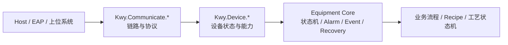

# Kwy.Communicate 半导体通信基线

本文档说明 `Kwy.Communicate.*` 在半导体设备软件中的职责边界和运行时约束。

## 职责边界

`Kwy.Communicate` 只负责通信链路：

- 建立、断开和释放底层连接。
- 统一连接状态：`Disconnected`、`Connecting`、`Connected`、`Reconnecting`、`Error`。
- 暴露链路错误事件。
- 执行 KeepAlive 健康检查。
- 在配置允许时执行链路级自动重连。
- 在重连后恢复协议上下文，例如 MQTT 订阅、OPC UA 订阅、SECS 接收循环。

`Kwy.Communicate` 不负责：

- 判断设备是否允许继续生产。
- 判断安全门、急停、气压、轴限位等安全状态。
- 自动恢复整机运行状态。
- 清除报警。
- 决定配方、批次、流程是否继续。

这些属于 `Kwy.Device` 和业务层的状态同步、安全联锁、恢复策略。

## 半导体设备推荐链路

## 自动重连原则

通信层允许自动重连，但只能恢复链路本身。

建议规则：

- `AutoReconnect = true` 只表示通信链路可以后台尝试恢复。
- 重连成功后只进入 `Connected`，不代表设备可以继续生产。
- 设备层必须重新执行状态同步。
- Equipment 层必须重新执行安全检查。
- 是否回到 `Idle`、`Ready` 或允许 `Resume`，由 `EquipmentRecoveryOrchestrator` 决定。

## KeepAlive 原则

KeepAlive 用于判断链路是否仍可用，不等同于设备工艺心跳。

推荐分层：

- TCP / Serial / GPIB：通信层 KeepAlive 只做链路健康判断。
- MQTT / OPC UA：优先使用协议自身会话、订阅和心跳能力。
- PLC：设备层可通过业务地址读取实现 PLC 心跳。
- SECS/GEM：通信层维护 HSMS/GEM 会话，设备状态由 GEM 事件变量和设备状态模型表达。

## 协议扩展规则

新增通信协议时：

1. 配置放在协议模块，例如 `Kwy.Communicate.Xxx.XxxConfig`。
2. 基础接口仍放 `Kwy.Communicate.Abstractions`。
3. 生命周期继承 `CommunicationClientBase`。
4. 主动读写型协议继承 `CommunicationBase`。
5. 消息流型协议不要再暴露底层流直接读取。
6. 读写失败要调用统一故障入口，让状态进入 `Error` 并触发重连策略。
7. 重连后必须恢复协议上下文。

## 与 Device 层的关系

通信层状态只能作为设备状态同步的输入之一。

设备驱动应把通信失败转换为设备错误，再交给：

- `IDeviceRegistry`
- `IEquipmentEventSink`
- `IAlarmService`
- `IEquipmentRecoveryOrchestrator`

这样才能形成半导体设备要求的 Event / Alarm / Recovery 链路。
