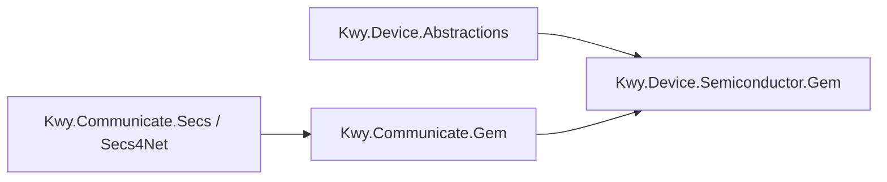

# Kwy.Device 架构说明

`Kwy.Device` 是 Kwy 框架中的设备层，负责统一 PLC、仪表、IO 卡、运动控制卡、相机等硬件设备的生命周期、配置、能力接口、状态同步、安全联锁和恢复策略。

设备层不直接承载业务工艺流程。它提供硬件抽象和恢复基础设施，业务项目或模板项目再基于这些能力编排工艺状态机。

## 分层结构

```text
Kwy.Device.Abstractions
  只定义接口、模型、配置和能力抽象。
  不引用厂商 SDK，不直接操作硬件。

Kwy.Device.Core
  提供通用基类和默认基础设施。
  例如 DeviceBase、DeviceRegistry、DeviceFactory、设备恢复服务、状态机、事务管理。

Kwy.Device.Instruments.*
Kwy.Device.IoCards.*
Kwy.Device.MotionCards.*
Kwy.Device.PLCs.*
Kwy.Device.Cameras.*
  厂商或协议实现层。
  负责调用 SDK、解析错误码、实现具体设备能力。

业务项目 / KwyTemplate
  负责工艺流程、状态机编排、人工确认、恢复策略选择、UI 交互。
```

依赖方向：

```text
业务项目
  -> Kwy.Device.Abstractions
  -> Kwy.Device.Core
  -> 具体设备实现项目
```

`Abstractions` 不应该引用任何厂商 SDK。厂商项目可以引用 `Abstractions` 和 `Core`。

## 五类设备

| 类型 | 抽象接口 | 说明 |
| --- | --- | --- |
| Instrument | `IInstrumentDevice` | 仪表，例如 LCR、电源、万用表。 |
| IO | `IIoCardDevice` | IO 卡或可提供 DI/DO 的设备。 |
| Motion | `IMotionCard` | 运动控制卡。 |
| PLC | `IPlcDevice` | PLC 设备。 |
| Vision | `ICameraDevice` | 相机、光源等视觉设备。 |

一个真实硬件可以同时实现多个能力接口。例如运动控制卡可能同时实现运动能力和 IO 能力。

## 生命周期

所有设备都实现 `IDevice`：

```csharp
public interface IDevice : IDisposable, IAsyncDisposable
{
    string DeviceId { get; }
    string DeviceName { get; }
    bool IsConnected { get; }
    ConnectionState State { get; }

    event EventHandler<ConnectionStateChangedEventArgs> StateChanged;
    event EventHandler<ErrorOccurredEventArgs> ErrorOccurred;

    Task ConnectAsync(CancellationToken cancellationToken = default);
    Task DisconnectAsync(CancellationToken cancellationToken = default);
}
```

生命周期职责：

```text
ConnectAsync
  打开设备或底层 SDK 连接。

DisconnectAsync
  断开设备或关闭底层 SDK 连接。

DisposeAsync
  最终释放资源。

StateChanged
  用于 UI、日志和恢复流程追踪设备状态。

ErrorOccurred
  用于统一上报设备错误。
```

`DeviceBase` 还提供两个生命周期钩子：

```csharp
protected virtual Task OnConnectedAsync(CancellationToken cancellationToken);
protected virtual Task OnDisconnectingAsync(CancellationToken cancellationToken);
```

它们用于设备连接成功后启动后台能力，例如 PLC 心跳、状态监控等；断开前则停止这些后台任务。

## Factory 与 Registry

`IDeviceFactory` 负责根据配置创建设备：

```text
配置对象 -> 设备实例
```

`IDeviceRegistry` 负责管理已经创建好的设备实例：

```text
DeviceId / 能力接口 -> 指定设备实例
```

推荐流程：

```text
加载配置
  -> IDeviceFactory.Create(config)
  -> IDeviceRegistry.AddOrUpdate(device)
  -> 业务服务按 DeviceId 获取设备
```

多设备项目不要只靠未命名接口注入。例如系统中可能同时存在：

```text
AdvantechIoCardDevice : IIoCardDevice
GoogolMotionCardDevice : IMotionCard, IIoCardDevice
```

此时推荐用 `IDeviceRegistry`：

```csharp
var io = registry.GetRequiredDevice<IIoCardDevice>("MainIo");
var motion = registry.GetRequiredDevice<IAxisMotionController>("MainMotion");
```

逻辑 IO 状态通过 `IIoStateMonitor` 管理：

```csharp
public sealed class StationService
{
    private readonly IIoStateMonitor ioMonitor;

    public StationService(IIoStateMonitor ioMonitor)
    {
        this.ioMonitor = ioMonitor;
    }

    public bool IsDoorClosed()
    {
        return ioMonitor.ReadDi("DI_DoorClosed");
    }
}
```

新项目应通过 `AddKwyDeviceCore()` 注册 `IIoStateMonitor`，再由 DI 注入使用，便于测试、仿真和多站点隔离。

## Motion 能力拆分

`IMotionCard` 只表示“这是一个运动控制卡设备”。具体运动能力按 capability interfaces 拆分：

| 接口 | 职责 |
| --- | --- |
| `IStandardMotionCard` | 标准运动卡组合接口。 |
| `IAdvancedMotionCard` | 高级运动卡组合接口，包含插补等能力。 |
| `IAxisMotionController` | 单轴运动控制。 |
| `IAxisStatusReader` | 单轴状态读取。 |
| `IMotionWaiter` | 等待轴停止、回零完成。 |
| `IInterpolationMotionController` | 坐标系插补。 |
| `IPositionCompareOutput` | 位置比较输出。 |

运动执行层还包含：

```text
IMotionStateMonitor
  后台采集轴状态快照。

IAxisMotionExecutor
  基于状态快照完成异步运动等待、限位/报警/掉使能检测。

IMotionSafetyGuard
  运动前安全校验。
```

## 状态同步与安全聚合

设备层的全局 `IDeviceStateSynchronizer` 和 `IDeviceSafetyGuard` 由 Core 聚合实现提供。厂商模块不要通过 `Replace()` 覆盖全局接口，而是注册自己的参与者：

```text
IDeviceStateParticipant
  某个具体设备的状态同步贡献。

IDeviceSafetyParticipant
  某个具体设备的安全检查贡献。
```

例如多台 HSL PLC 可以各自注册 `HslPlcStateSynchronizer` 和 `HslPlcSafetyGuard`。Core 会统一汇总所有参与者的状态、报警、离线和安全违规结果，避免后注册设备覆盖先注册设备。

## PLC 心跳

PLC 心跳是 PLC 协议层能力，不等同于 TCP Socket KeepAlive。

TCP KeepAlive 只能说明网络通道可能仍存在；PLC KeepAlive 会按 `KeepAliveAddress` 读取一个安全点位，用来确认 PLC 协议读写仍然可用。

PLC 心跳配置抽象为 `IPlcKeepAliveConfig`，默认放在 `PlcConfig` 中：

```csharp
public class PlcConfig : IDeviceConfig, IPlcKeepAliveConfig
{
    public bool KeepAlive { get; set; } = true;
    public int KeepAliveInterval { get; set; } = 1000;
    public string? KeepAliveAddress { get; set; }
    public PlcKeepAliveMode KeepAliveMode { get; set; } = PlcKeepAliveMode.ReadBool;
}
```

示例：

```csharp
var config = new HslPlcConfig
{
    IpAddress = "192.168.0.10",
    Brand = HslPlcBrandType.Siemens_S71200,
    KeepAlive = true,
    KeepAliveInterval = 1000,
    KeepAliveAddress = "M0",
    KeepAliveMode = PlcKeepAliveMode.ReadBool
};
```

建议使用只读、安全、不影响设备动作的地址作为心跳地址。框架默认不写 PLC 心跳位，避免通用库改变设备逻辑。

## 半导体设备恢复分层

半导体行业中，通信重连不能直接代表设备可以继续生产。设备恢复应拆成以下几层：

```text
通信链路层
  TCP / Serial / GPIB / MQTT / OPC UA 的连接、断开、重连、KeepAlive。

协议事务层
  命令、响应、事务 ID、ACK / NAK、断线后的挂起事务清理。

设备状态同步层
  重连后重新读取 Online、Ready、Alarm、Remote、Recipe 等状态。

安全联锁层
  检查急停、安全门、气压、真空、光幕、轴报警、PLC 安全位。

恢复策略层
  决定重连后人工确认、恢复到 Idle，还是满足条件后允许继续。

流程状态机层
  管理 Idle、Running、Recovering、Error、ManualInterventionRequired。
```

对应抽象：

| 层级 | 抽象 | 说明 |
| --- | --- | --- |
| 协议事务 | `ICommandSession`、`ITransactionManager` | 管理命令、响应、事务 ID 和挂起事务。 |
| 状态同步 | `IDeviceStateSynchronizer` | 重连后重新读取设备状态。 |
| 安全联锁 | `IDeviceSafetyGuard` | 检查设备是否满足安全条件。 |
| 恢复策略 | `IDeviceRecoveryService`、`RecoveryPolicy` | 执行恢复流程并输出恢复结果。 |
| 设备恢复参与者 | `IDeviceRecoveryParticipant` | 按 DeviceId 封装单个设备的状态同步、安全检查和恢复策略。 |
| 状态机 | `IEquipmentStateMachine` | 管理设备运行状态。 |

Core 默认实现：

| 服务 | 默认实现 | 说明 |
| --- | --- | --- |
| `IEquipmentStateMachine` | `EquipmentStateMachine` | 提供半导体设备常见状态和白名单迁移规则。 |
| `IEquipmentModeService` | `EquipmentModeService` | 管理 Local/Remote、Manual/Auto/Production 等设备模式。 |
| `IEquipmentEventSink` | `InMemoryEquipmentEventSink` | 记录设备事件。后续可替换为日志、数据库或 MES 上报。 |
| `IAlarmService` | `InMemoryAlarmService` | 管理当前活动报警，并同步发布报警事件。 |
| `IAuditTrail` | `InMemoryAuditTrail` | 记录操作审计。 |
| `IRecipeRepository` | `InMemoryRecipeRepository` | 内存配方仓库，业务项目可替换为文件或数据库实现。 |
| `IRecipeValidator` | `DefaultRecipeValidator` | 默认只校验 RecipeId 和 Version。 |
| `IRecipeApplier` | `NoOpRecipeApplier` | 默认不下发到设备，厂商/业务层按需替换。 |
| `IRecipeService` | `RecipeService` | 加载、校验、应用配方并记录审计。 |
| `IEquipmentRecoveryOrchestrator` | `EquipmentRecoveryOrchestrator` | 对 Registry 中的设备执行整机恢复编排。 |
| `IEquipmentProcessController` | `EquipmentProcessController` | 提供 Initialize、Start、Pause、Resume、Stop、Abort、Clear 标准流程入口。 |

## 运行状态与迁移规则

`EquipmentRunState` 对标半导体设备常见运行状态：

```text
Unknown
Idle
Initializing
Ready
Running
Pausing
Paused
Resuming
Stopping
Stopped
Recovering
Alarm
Error
Manual
Maintenance
ManualInterventionRequired
```

状态机使用白名单迁移规则，避免业务代码随意跳状态。例如：

```text
Running
  -> Pausing
  -> Stopping
  -> Alarm
  -> Error

Error
  -> Recovering
  -> ManualInterventionRequired
  -> Maintenance

Recovering
  -> Idle
  -> Ready
  -> ManualInterventionRequired
  -> Error
```

使用方式：

```csharp
EquipmentStateTransitionResult result = stateMachine.CanTransitionTo(EquipmentRunState.Running);
if (result.IsAllowed)
{
    await stateMachine.TransitionAsync(EquipmentRunState.Running, "Cycle started");
}
```

非法迁移会抛出异常，便于尽早发现流程状态设计问题。

## Equipment Mode

设备模式不要混入连接状态。连接状态只表达通信生命周期，设备模式表达控制权和运行方式。

```csharp
await modeService.SetModeAsync(
    new EquipmentMode(
        EquipmentControlMode.Remote,
        EquipmentOperationMode.Production),
    "MES granted remote production mode");
```

常见模式：

```text
ControlMode:
  Local
  Remote

OperationMode:
  Manual
  Auto
  DryRun
  Maintenance
  Engineering
  Production
```

## Alarm / Event / Audit

半导体设备必须具备可追溯性。Kwy 将运行信息拆成三类：

| 类型 | 抽象 | 说明 |
| --- | --- | --- |
| Event | `IEquipmentEventSink` | 普通设备事件，例如状态变化、恢复结果、运行提示。 |
| Alarm | `IAlarmService` | 当前活动报警、报警确认、报警清除。 |
| Audit | `IAuditTrail` | 操作员、配方切换、恢复确认等审计记录。 |

示例：

```csharp
await alarmService.RaiseAsync(new EquipmentAlarm(
    Code: "PLC.EStop",
    Message: "急停未复位",
    Severity: EquipmentEventSeverity.Critical,
    Source: "MainPlc"));

await auditTrail.RecordAsync(new EquipmentAuditRecord(
    Action: "RecipeApplied",
    Operator: "Engineer",
    Message: "Applied recipe R001"));
```

默认实现是内存实现，适合开发和单机模板。正式项目可以替换为 Serilog、数据库、MES 或 SECS/GEM 上报实现。

## Recipe

配方模型用于表达工艺参数集合：

```csharp
var recipe = new EquipmentRecipe(
    RecipeId: "R001",
    Version: "1.0",
    Parameters:
    [
        new RecipeParameter("Speed", "100", "mm/s"),
        new RecipeParameter("Pressure", "0.5", "MPa")
    ],
    Name: "Default");
```

核心抽象：

| 抽象 | 说明 |
| --- | --- |
| `IRecipeRepository` | 存取配方。 |
| `IRecipeValidator` | 校验配方合法性。 |
| `IRecipeApplier` | 将配方应用到设备或流程。 |
| `IRecipeService` | 组合加载、校验、应用和审计。 |

默认 `NoOpRecipeApplier` 不会下发到设备，只表示配方已通过默认校验。设备项目或业务项目应按实际硬件替换 `IRecipeApplier`。

## 整机流程控制

`IEquipmentProcessController` 提供半导体设备常见流程入口：

```text
Initialize
Start
Pause
Resume
Stop
Abort
Clear
```

默认实现只做状态机迁移、安全检查、状态同步和事件记录，不直接执行危险动作。真正的工艺流程应由业务流程引擎或设备专用控制器接管。

示例：

```csharp
await processController.InitializeAsync();
await processController.StartAsync();
await processController.PauseAsync();
await processController.ResumeAsync();
await processController.StopAsync();
```

## 状态同步

状态同步用于回答：

```text
通信已经恢复，但设备现在到底处于什么状态？
```

接口：

```csharp
public interface IDeviceStateSynchronizer
{
    Task<DeviceSyncResult> SyncStateAsync(CancellationToken cancellationToken = default);
}
```

典型同步内容：

```text
Online / Offline
Ready / Busy
Alarm / AlarmCode
Remote / Local
Auto / Manual
Recipe
Lot / Carrier / Wafer 状态
```

`DeviceSyncResult` 不直接决定是否恢复生产，只表达设备状态同步结果。恢复策略服务会使用它做下一步判断。

## 安全联锁

安全联锁用于回答：

```text
设备现在是否满足允许操作的安全条件？
```

接口：

```csharp
public interface IDeviceSafetyGuard
{
    Task<DeviceSafetyResult> CheckAsync(CancellationToken cancellationToken = default);
}
```

典型检查内容：

```text
急停已复位
安全门关闭
气压正常
真空正常
光幕未触发
PLC 安全位正常
轴无报警
伺服使能状态符合预期
```

安全联锁失败时返回 `DeviceSafetyViolation`，由上层 UI、日志或恢复策略决定是否需要人工干预。

## 恢复策略

恢复策略用于回答：

```text
设备重新连上后，允许系统自动做到哪一步？
```

策略枚举：

```csharp
public enum RecoveryPolicy
{
    ManualOnly,
    AutoReconnectOnly,
    AutoRecoverToIdle,
    AutoResumeWhenSafe
}
```

建议：

| 策略 | 适用场景 |
| --- | --- |
| `ManualOnly` | 高风险设备，必须人工确认。 |
| `AutoReconnectOnly` | 只允许底层链路恢复，不自动同步和恢复。 |
| `AutoRecoverToIdle` | 自动同步状态并检查安全，恢复到 Idle。 |
| `AutoResumeWhenSafe` | 风险评估明确、状态同步和安全联锁完整时才使用。 |

恢复服务接口：

```csharp
public interface IDeviceRecoveryService
{
    Task<DeviceRecoveryResult> RecoverAsync(
        DeviceRecoveryContext context,
        CancellationToken cancellationToken = default);
}
```

恢复流程：

```text
通信重连成功
  -> SyncStateAsync()
  -> CheckAsync()
  -> 根据 RecoveryPolicy 输出恢复结果
  -> 业务状态机决定是否继续、停止或等待人工确认
```

整机恢复由 `IEquipmentRecoveryOrchestrator` 负责。它优先使用已注册的 `IDeviceRecoveryParticipant`，按 `DeviceId` 对每个设备执行专用恢复逻辑；如果没有注册参与者，则退回到默认 `IDeviceRecoveryService`。

```csharp
EquipmentRecoveryOrchestrationResult result =
    await recoveryOrchestrator.RecoverAsync(RecoveryPolicy.AutoRecoverToIdle);

if (!result.IsRecovered)
{
    await stateMachine.TransitionAsync(
        EquipmentRunState.ManualInterventionRequired,
        "Recovery requires manual confirmation.");
}
```

`IDeviceRecoveryParticipant` 适合多设备项目。例如主 PLC、运动卡、相机可以分别提供不同的状态同步和安全检查逻辑，再由整机恢复编排器统一执行。

## HSL PLC 接入示例

`Kwy.Device.PLCs.Hsl` 已接入 PLC 心跳、状态同步、安全联锁和恢复服务。

注册示例：

```csharp
services.AddKwyDeviceCore();

services.AddKwyHslPlc(
    deviceId: "MainPlc",
    deviceName: "主 PLC",
    configure: options =>
    {
        options.Brand = HslPlcBrandType.Siemens_S71200;
        options.IpAddress = "192.168.0.10";
        options.Port = 102;
        options.Rack = 0;
        options.Slot = 1;

        options.KeepAlive = true;
        options.KeepAliveInterval = 1000;
        options.KeepAliveAddress = "M0";
        options.KeepAliveMode = PlcKeepAliveMode.ReadBool;
    },
    configureRuntime: runtime =>
    {
        runtime.StatePoints.Add(new("Ready", "M10", HslPlcPointValueType.Bool));
        runtime.StatePoints.Add(new("AlarmCode", "D100", HslPlcPointValueType.Int16));

        runtime.SafetyPoints.Add(new("EmergencyOk", "M20", ExpectedValue: true, Message: "急停未复位"));
        runtime.SafetyPoints.Add(new("DoorClosed", "M21", ExpectedValue: true, Message: "安全门未关闭"));
        runtime.SafetyPoints.Add(new("AirPressureOk", "M22", ExpectedValue: true, Message: "气压不足"));
    });
```

恢复调用：

```csharp
var result = await recoveryService.RecoverAsync(
    new DeviceRecoveryContext(
        DeviceId: "MainPlc",
        Policy: RecoveryPolicy.AutoRecoverToIdle),
    cancellationToken);
```

## IOC 注册

Core 注册：

```csharp
services.AddKwyDeviceCore();
```

它会注册：

```text
IDeviceFactory           -> DeviceFactory
IDeviceRegistry          -> DeviceRegistry
ICameraRegistry          -> CameraRegistry
IDeviceStateSynchronizer -> NoOpDeviceStateSynchronizer
IDeviceSafetyGuard       -> DeviceSafetyGuard
IDeviceRecoveryService   -> DeviceRecoveryService
IEquipmentStateMachine   -> EquipmentStateMachine
IEquipmentModeService    -> EquipmentModeService
IEquipmentEventSink      -> InMemoryEquipmentEventSink
IAlarmService            -> InMemoryAlarmService
IAuditTrail              -> InMemoryAuditTrail
IRecipeRepository        -> InMemoryRecipeRepository
IRecipeValidator         -> DefaultRecipeValidator
IRecipeApplier           -> NoOpRecipeApplier
IRecipeService           -> RecipeService
IEquipmentRecoveryOrchestrator -> EquipmentRecoveryOrchestrator
ITransactionManager      -> InMemoryTransactionManager
```

厂商模块可以替换默认同步器和安全检查器。例如 HSL PLC 会注册：

```text
IDeviceStateSynchronizer -> HslPlcStateSynchronizer
IDeviceSafetyGuard       -> HslPlcSafetyGuard
IDeviceRecoveryParticipant -> DeviceRecoveryParticipant(MainPlc)
```

## 设备层到 GEM 的桥接

`Kwy.Device.Semiconductor.Gem` 是可选桥接模块，用于把设备层的运行状态、事件和报警转换为 GEM 上报。

引用方向保持为：



这样 `Kwy.Communicate.Gem` 不需要反向依赖设备层，后续如果替换为 Cimetrix、商业 GEM SDK 或其他 SECS/GEM 适配器，设备层模型仍然稳定。

注册示例：

```csharp
services.AddKwyDeviceCore();
services.AddSingleton<ISecsClient>(secsClient);
services.AddSingleton<GemRegistry>();
services.AddSingleton<IGemEquipment, GemEquipmentService>();

services.AddKwyDeviceGemBridge(options =>
{
    options.StateChangedCeid = 1000;
    options.EventIds["RecipeApplied"] = 2101;
    options.AlarmIds["PLC_ESTOP"] = 3001;
});
```

桥接模块会把 `IEquipmentEventSink` 替换为 GEM 桥接实现，因此 `IAlarmService`、`IAuditTrail`、`IEquipmentProcessController` 发布的事件可以进入 GEM 上报链路。

默认映射规则：

| 设备层对象 | GEM 对象 |
| --- | --- |
| `EquipmentRunState` 状态变化 | `CEID + RPTID + VID` |
| `EquipmentEvent` | `S6F11 EventReport` |
| `EquipmentEventKind.Alarm` | `S5F1 AlarmReport`，并可同时上报事件 |

正式半导体项目不建议依赖自动生成 ID。客户验收前应把 `CEID / RPTID / VID / ALID` 表显式配置到 `GemEquipmentBridgeOptions`，并与 EAP/MES 的 SML 文件保持一致。

## 设计边界

通信层只负责：

```text
连接、断开、读写、KeepAlive、重连、错误事件。
```

设备层负责：

```text
设备生命周期、能力接口、状态同步、安全联锁、恢复策略基础设施。
```

业务层负责：

```text
流程状态机、人工确认、工艺继续或中止、报警处理、UI 交互。
```

这样可以避免底层通信库在重连后擅自继续危险动作，也能让不同设备的恢复策略保持可控、可审计、可测试。

## 新增设备实现建议

新增设备时建议：

1. 配置类实现 `IDeviceConfig`。
2. 设备类继承对应 Core 基类，例如 `DeviceBase`、`MotionCardBase`、`IoCardBase`、`PlcDeviceBase`。
3. 厂商 SDK 错误码留在厂商模块内处理。
4. 对外只暴露 Kwy 抽象接口。
5. 如果设备同时具备多种能力，可以实现多个能力接口。
6. 如果设备需要恢复闭环，提供 `IDeviceStateSynchronizer` 和 `IDeviceSafetyGuard` 实现。
7. 在厂商项目中提供 `AddKwyXxxDevice(...)` IOC 注册扩展。
8. 在文档中说明硬件驱动、配置参数、生命周期、心跳、状态同步、安全联锁和资源释放。
