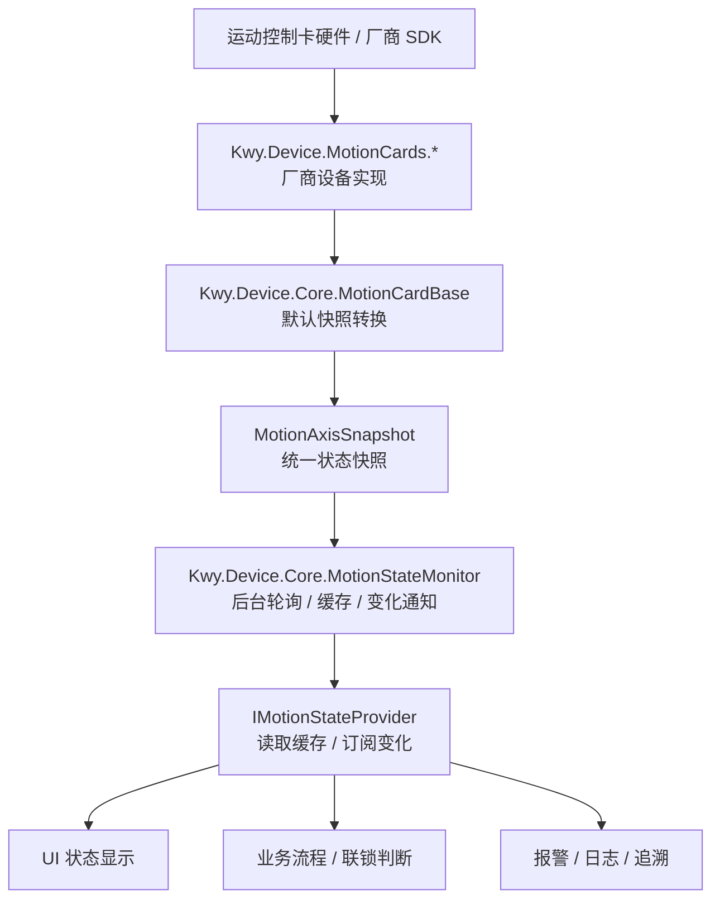
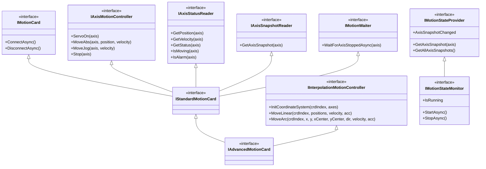
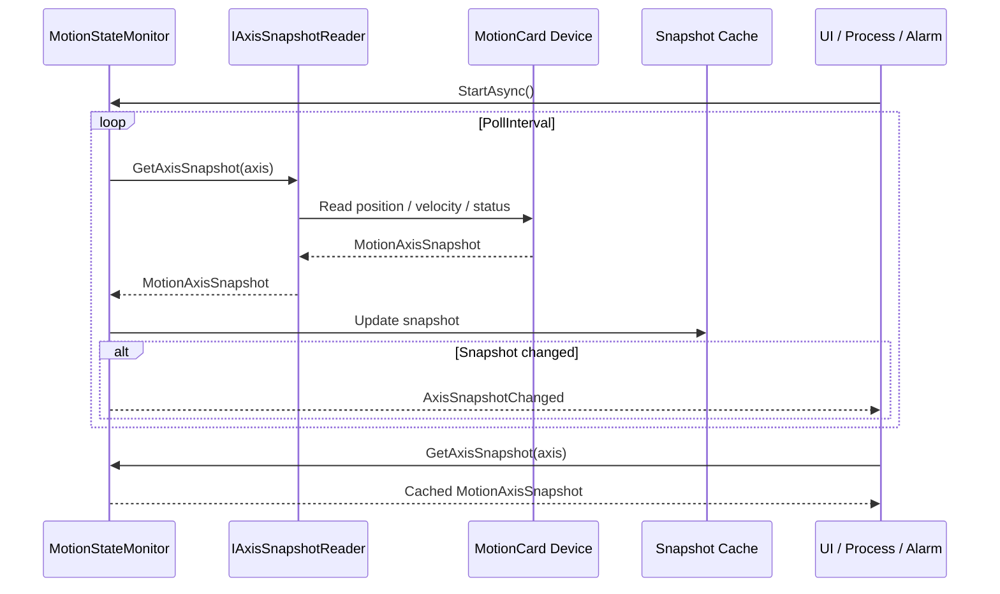

# Motion State Design

运动控制的状态读取不应该散落在业务层。Kwy.Device 的设计是：

```text
厂商设备实现真实状态读取
Kwy.Device.Core 负责状态轮询、缓存和变化通知
业务层只读取快照或订阅变化
```

## 架构关系图



## 接口关系图



## 状态流转图



## 核心类型

| 类型 | 职责 |
| --- | --- |
| `MotionAxisSnapshot` | 单轴不可变状态快照，包含位置、编码器位置、速度、原始状态位、运动中、报警、正负限位和时间戳。 |
| `IAxisSnapshotReader` | 从设备读取某一轴的实时快照。 |
| `IMotionStateProvider` | 提供当前缓存快照和 `AxisSnapshotChanged` 变化事件。 |
| `IMotionStateMonitor` | 后台状态监控器，周期读取快照、缓存状态、发布变化通知。 |

## 使用方式

普通业务流程建议读取缓存快照：

```csharp
public sealed class MotionProcess
{
    private readonly IStandardMotionCard motion;
    private readonly IMotionStateProvider stateProvider;

    public MotionProcess(
        IStandardMotionCard motion,
        IMotionStateProvider stateProvider)
    {
        this.motion = motion;
        this.stateProvider = stateProvider;
    }

    public void MoveIfReady()
    {
        var axis1 = stateProvider.GetAxisSnapshot(1);
        if (!axis1.IsAlarm && !axis1.IsMoving)
        {
            motion.MoveAbs(1, 10000, 100);
        }
    }
}
```

UI、报警、日志等场景建议订阅变化事件：

```csharp
public sealed class MotionStatusViewModel
{
    private readonly IMotionStateProvider stateProvider;

    public MotionStatusViewModel(IMotionStateProvider stateProvider)
    {
        this.stateProvider = stateProvider;
        this.stateProvider.AxisSnapshotChanged += OnAxisSnapshotChanged;
    }

    private void OnAxisSnapshotChanged(object? sender, MotionAxisSnapshotChangedEventArgs e)
    {
        var axis = e.Snapshot.Axis;
        var position = e.Snapshot.Position;
        var isAlarm = e.Snapshot.IsAlarm;
    }
}
```

## 注册状态监控器

如果厂商模块没有自动注册状态监控器，可以在业务项目中注册：

```csharp
services.AddKwyMotionStateMonitor(options =>
{
    options.PollInterval = TimeSpan.FromMilliseconds(50);
    options.FirstAxis = 1;
    options.AxisCount = 8;
});
```

`Kwy.Device.MotionCards.Googol` 会默认注册 `IMotionStateMonitor` 和 `IMotionStateProvider`，默认按 `GoogolMotionCardConfig.AxisCount` 从 1 号轴开始采集。

## 分层原则

```text
Kwy.Device.Abstractions
  定义状态模型和状态接口

Kwy.Device.Core
  提供通用状态监控、缓存和事件

Kwy.Device.MotionCards.*
  从厂商 SDK 读取真实状态，并转换为 MotionAxisSnapshot

业务层
  消费状态，不维护状态采集系统
```
