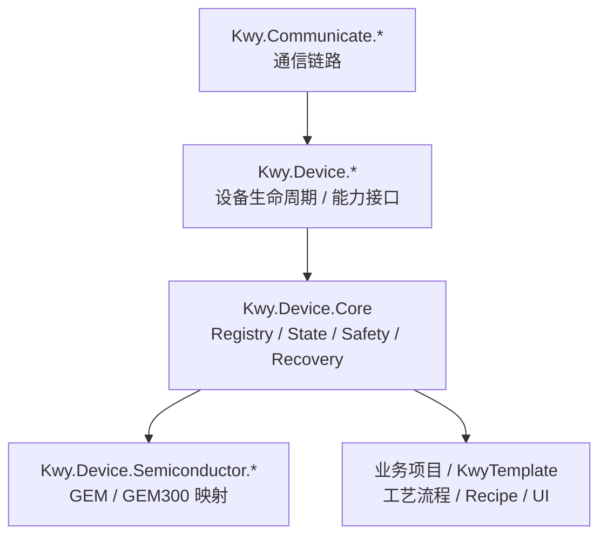
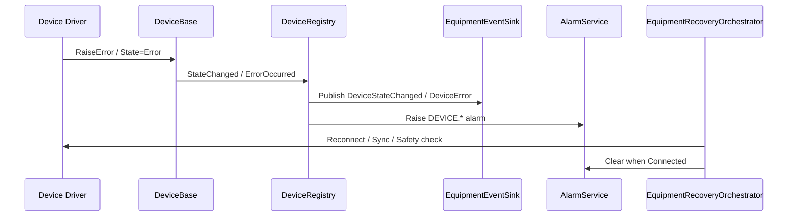

# Kwy.Device 半导体设备基线

本文档说明 `Kwy.Device.*` 面向半导体设备时的架构边界、状态链路和扩展规则。

## 分层职责

## 设备层只做硬件抽象

设备层负责：

- 连接、断开、释放设备。
- 暴露设备状态和错误。
- 实现 PLC、运动卡、IO、仪表、相机等能力接口。
- 将厂商 SDK 错误转换为统一异常、事件和状态。
- 提供状态同步、安全检查和恢复的基础能力。

设备层不负责：

- 编排完整工艺流程。
- 自动决定批次继续或暂停。
- 直接实现 UI 交互。
- 直接绑定具体 EAP/GEM 业务语义。

## 状态链路

推荐运行链路：

## 当前基线实现

当前 `Kwy.Device.Core` 已提供：

- `DeviceBase`：统一连接、断开、失败清理和释放。
- `DeviceRegistry`：集中管理设备，并把设备状态和错误桥接到 Event / Alarm。
- `EquipmentStateMachine`：整机运行状态迁移规则。
- `EquipmentProcessController`：Initialize / Start / Pause / Resume / Stop / Abort / Clear。
- `IEquipmentEventSink`：事件出口。
- `IAlarmService`：报警管理。
- `IAuditTrail`：审计记录。
- `IRecipeService`：配方基础模型。
- `IEquipmentRecoveryOrchestrator`：恢复编排。
- `IMotionStateMonitor`：运动状态后台同步。
- `IAxisMotionExecutor`：轴运动执行与完成等待。

## 半导体设备运行规则

### Start

`StartAsync()` 必须先执行：

1. 设备状态同步。
2. 安全联锁检查。
3. 状态机允许性检查。
4. 进入 `Running`。

### Resume

`ResumeAsync()` 必须重新执行状态同步和安全检查。

原因是暂停期间可能发生：

- 门禁打开。
- 急停触发。
- 气压不足。
- PLC 通信断开。
- 运动轴报警。
- 相机离线。

### Clear

`ClearAsync()` 不能直接从 Error 回到 Idle。

必须先进入 `Recovering`，然后：

1. 同步设备状态。
2. 检查安全联锁。
3. 确认设备可恢复。
4. 成功才进入 `Idle`。
5. 失败进入 `ManualInterventionRequired`。

## 通信失败处理

通信失败不应直接让设备继续生产。

推荐路径：

1. 通信层进入 `Error` 或开始链路重连。
2. 设备驱动捕获读写失败。
3. 设备调用统一故障入口。
4. `DeviceRegistry` 发布 Event 和 Alarm。
5. Equipment 层决定是否恢复。

## 驱动扩展规则

新增设备驱动时：

1. 厂商配置保留在厂商项目。
2. 厂商 SDK 映射、错误码转换保留在厂商项目。
3. 通用能力接口放在 `Kwy.Device.Abstractions`。
4. 公共生命周期放在 `Kwy.Device.Core`。
5. 读写失败必须进入设备故障链路。
6. 不要在驱动内部自动清报警或恢复生产。
7. 多设备场景必须通过 `IDeviceRegistry` 或专用 Runtime Registry 按 `DeviceId` 选择。

## GEM / GEM300 关系

`Kwy.Device.Semiconductor.*` 是设备层到半导体协议语义的桥接层。

建议：

- SECS/HSMS 放在 `Kwy.Communicate.Secs.*`。
- GEM 能力放在 `Kwy.Communicate.Gem`。
- GEM300 能力放在 `Kwy.Communicate.Gem300`。
- 设备状态、事件、报警、配方由 `Kwy.Device.Core` 提供。
- GEM/GEM300 只做协议变量、事件、报警、状态模型映射。

这样后续替换 Secs4Net、Cimetrix 或其他商业库时，设备层不需要重写。
