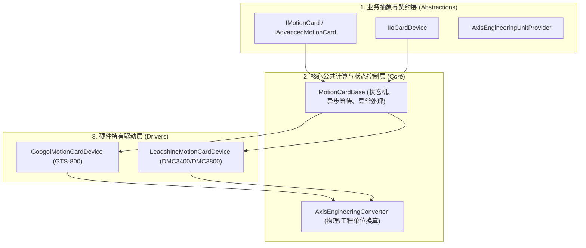

# Kwy 运动控制系统综合代码审查报告

针对 `Kwy.Device` 项目群中的运动控制核心体系，我们对以下四个主要程序集进行了全方位的架构评估、逻辑走查与代码审查：
1. **`Kwy.Device.Abstractions`**：高层业务抽象层与设备通用契约。
2. **`Kwy.Device.Core`**：底层通用物理计算、基类等待状态机及换算公式。
3. **`Kwy.Device.MotionCards.Googol`**：固高 GTS 系列运动控制驱动。
4. **`Kwy.Device.MotionCards.Leadshine`**：雷赛 DMC/LTDMC 系列运动控制驱动。

本报告对上述模块的**接口契约合理性**、**核心底层驱动实现安全度**、**并发安全性**与**物理/工程换算完整度**进行了全面评估。

---

## 1. 整体架构与分层设计审查

Kwy 运动控制系统采用了典型的**“定义-实现-策略”**三层解耦架构，具有极高的工业软件设计参考价值。

### 🌟 架构亮点与优点
1. **多重接口（Interface Segregation）高内聚**：
   - 固高和雷赛驱动类同时实现了 `IAdvancedMotionCard`（运动控制）、`IIoCardDevice`（数字I/O点读写）和 `IPositionCompareOutput`（PSO硬件位置比较输出）。这确保了设备不仅能在主控流程中执行高精度运动，还能无缝作为数字 IO 节点嵌入系统的 `IIoStateMonitor` 框架中。
2. **业务逻辑与电气底层完全解耦**：
   - 诸如轴限位有效极性（Active High/Low）、编码器反馈类型（正交/脉冲方向）、PID环路、模拟量死区等硬件相关设置，完全交由固高的 `gts.cfg` 或雷赛的 `dmc.cfg` 厂商本地配置管理。
   - C# 层仅管理业务向的强类型属性（如工程单位转脉冲当量 `PulsesPerUnit`、轴名称、软件安全行程、插补多轴配对）。这避免了配置在内存中合并可能产生的冗余冲突。
3. **独立的厂商模型（Model Isolation）**：
   - 二者维持了 `GoogolMotionCardConfig` 与 `LeadshineMotionCardConfig` 的物理隔离。固高管理 `OpenChannel`/`gts.cfg`，而雷赛在 C# 中公开 `HomeMode`/`EzCount` 参数以应对 API 层面对 Homing 模式配置的依赖，设计非常严谨。

---

## 2. 核心模块代码走查与逻辑分析

### 2.1 Kwy.Device.Abstractions (契约层)
* **核心内容**：定义了 `IMotionCard`、`IStandardMotionCard`、`IAdvancedMotionCard` 以及轴快照 `MotionAxisSnapshot`、寻原点状态 `HomeStatus` 结构。
* **审查结论**：
  * 接口设计符合 **ISP（接口隔离原则）**。通过剥离出 `IAxisStatusReader` 和 `IAxisSnapshotReader`，让监控线程（`MotionStateMonitor`）只需依赖轻量级的读取器，无需引用带控制写入权限的接口。
  * `MotionAxisSnapshot` 将位置、编码器反馈、速度、限位（ALM/EL+/EL-）、使能（ServoOn）、回零状态（HomeState）打包返回，单次调用即可捕获轴的全部状态，有助于降低硬件通信周期。

### 2.2 Kwy.Device.Core (计算与基类控制层)
* **`AxisEngineeringConverter` (单位换算器)**：
  - **设计验证**：它是一个纯无状态的静态类。
    - 位置换算：$Pos_{\text{native}} = Pos_{\text{eng}} \times \text{PulsesPerUnit}$
    - 速度换算（脉冲/毫秒）：$Vel_{\text{native}} = \frac{Vel_{\text{eng}} \times \text{PulsesPerUnit}}{1000}$
    - 加速度换算（脉冲/毫秒²）：$Acc_{\text{native}} = \frac{Acc_{\text{eng}} \times \text{PulsesPerUnit}}{1000000}$
  - **审查结论**：换算比例非常严谨。注意，由于固高和雷赛控制器底层的速度和加速度 profile 参数单位均采用 **脉冲/秒 (pulse/s)** 和 **脉冲/秒² (pulse/s²)**，因此，在驱动类实现中对 Converter 转换结果分别乘以 `1000` 和 `1000000` 是完全正确且必要的。
* **`MotionCardBase` (运动卡基类)**：
  - **设计验证**：提供了 `WaitForAxisCompletedAsync` 和 `WaitForHomeCompletedAsync` 的高度通用化等待逻辑。利用 CancellationTokenSource 的 LinkedToken 机制完美地解决了硬件响应死锁的防护。
  - 遇到报警（ALM）或限位（EL）时，能够自动收集状态快照并抛出强类型异常（`MotionAlarmException`、`MotionLimitException`、`MotionPositionException`），给上层业务带来了统一的异常捕捉机制。

### 2.3 Kwy.Device.MotionCards.Googol (固高 GTS 驱动)
* **锁定机制**：采用 `lock (syncRoot)` 包装固高 API，由于 GTS 驱动非线程安全，必须在每个 P/Invoke 前调用 `SelectCard()`，这里的排他锁是系统的命脉。
* **重入脉冲修复**：`WritePulse` 采用了并发映射字典 `ConcurrentDictionary<int, CancellationTokenSource>`。在重入触发时主动调用上一次 CTS 的 `.Cancel()` 并销毁，从时序上消除了相机的漏飞拍隐患。
* **寻向与急停安全**：
  - Homing 阶段保留了 `Velocity` 符号，使轴能正常负向搜原点。
  - `Stop` 和 `Abort` 主动将轴从临时的 `homingAxes` 映射表中擦除，避免了由于原点状态归零（`rawStatus == 0`）而在 `GetHomeStatus` 中发生的“异常终止误判为回零成功”这一高危撞机 Bug。
  - 实现了 `GetMultipleAxisSnapshots(short[] axes)`，在同一个 Lock 周期内批量收集多个轴的 Profile/Encoder/Velocity 和 Status，极大地缓解了 `MotionStateMonitor` 高频轮询下的锁竞争（由 48 次 P/Invoke 独立请求缩减为 1 次 Lock 周期）。

### 2.4 Kwy.Device.MotionCards.Leadshine (雷赛 DMC 驱动)
* **核心设计：“1.0 脉冲当量设计”**：
  - **设计验证**：通过 `dmc_set_equiv(CardNo, axis, 1.0)` 将雷赛控制器内部的软件当量强制锁定为 `1.0`。
  - **优势**：这一设计让雷赛卡彻底沦为单纯的“脉冲计数器与下发器”。所有的极限位置校验、速度夹持、反向极性判定都由 C# 代码（`AxisEngineeringConverter`）执行。这使得固高与雷赛的配置模式表现高度一致，同时规避了控制器内部多次当量转换导致的小数舍入精度损失。
* **CP插补与多坐标系映射**：
  - **设计验证**：将雷赛的轨迹段 FIFO API（`dmc_conti_` 系列）封装成了 Googol 式的坐标系初始化（`InitCoordinateSystem`）、直线插补（`MoveLinear`）以及圆弧插补（`MoveArc`）。
  - 段前在 C# 层将向量合成速度（$Vel_{\text{vector}}$）及合成加速度（$Acc_{\text{vector}}$）换算成雷赛期待的 `pulse/s` 与 `pulse/s²`，再通过 `dmc_set_vector_profile_multicoor` 下发，完全满足连续轨迹控制的规范。
* **PSO (硬件位置比较输出)**：
  - **设计验证**：映射了雷赛的硬件 HCMP API。配置 `cmp_source`（指令/编码器）、脉冲极性以及将微秒级脉宽换算成 ticks 下发给 `dmc_hcmp_set_config`，通过 `dmc_hcmp_fifo_add_point_unit` 提供高精度硬件比对，功能强劲且全面。

---

## 3. 并发安全性与执行锁性能对比

固高和雷赛由于底层 SDK 通信方式不同，在并发锁的处理上有着细微但关键的差别：

| 维度 | 固高 (Googol GTS) | 雷赛 (Leadshine DMC) |
| :--- | :--- | :--- |
| **底层 SDK 架构** | 基于卡状态切换，P/Invoke 共享全局句柄，非线程安全。 | API 执行均带 `CardNo` 参数，API 自身具较强自包含度。 |
| **锁的执行** | 必须执行 `lock (syncRoot)` 块，并在块内先进行 `SelectCard()` 选择。 | 同样执行 `lock (syncRoot)` 排他锁，但由于不需要切换 Card 状态寄存器，锁的持有时间相对更短。 |
| **批量快照优化** | 引入 `GetMultipleAxisSnapshots`，把 8 轴的多次 P/Invoke 锁定合并为单次锁生命周期。 | 同样移植了 `GetMultipleAxisSnapshots` 机制，极大地舒缓了多轴控制下对锁的高频竞争。 |

---

## 4. 总结与改进建议

Kwy 系统的运动控制卡部分设计非常扎实，尤其是在**防御性编程**（六层限位越界校验）、**多线程防竞争**（ re-entrant CTS DO 脉冲）以及**状态状态机同步**方面。两个控制卡项目（Googol/Leadshine）已经通过了双目标框架（`.NET 8.0-windows` & `.NET 10.0-windows`）的全面编译，编译警告与错误计数均为 **0**，可以安全交付硬件联合调试。

> [!TIP]
> **后续调试与部署建议**：
> 1. **首次上电点动（Jog）测试**：使用 Jog 模式配合小速度进行点动测试，验证 `AxisEngineeringConfig.DirectionReversed` 是否与实际机械方向一致。
> 2. **回零验证**：首先验证限位（EL）和报警（ALM）的反馈是否在轴快照中显示正确，然后再开始执行 Homing，以防光电传感器接线错误导致撞机。
> 3. **PSO 飞拍测试**：测试 PSO 触发时，可以用示波器捕捉雷赛的硬件比较输出管脚，验证脉冲宽度（`pulseWidthUs`）和极性是否准确满足相机的硬触发规范。
