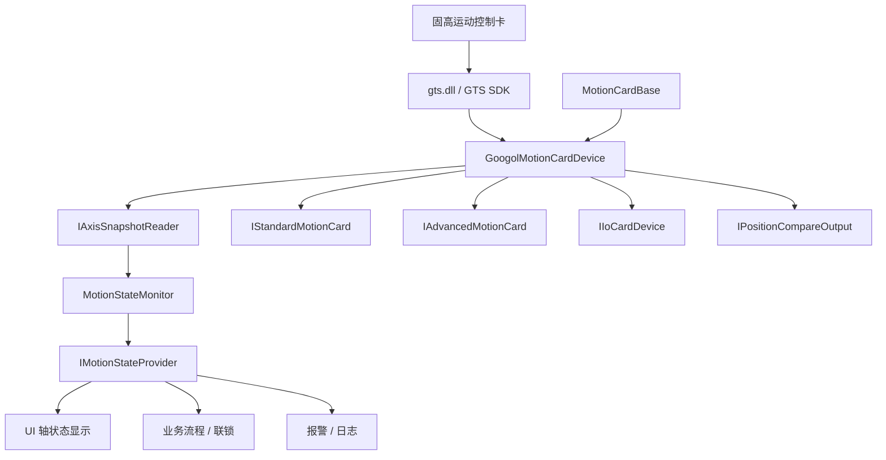
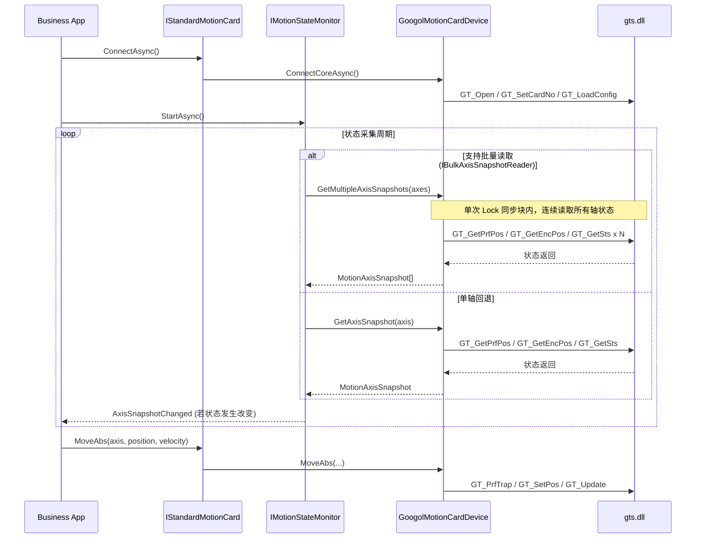

# Kwy.Device.MotionCards.Googol Architecture

## 模块关系图



## 状态采集时序图



## 分层边界


业务层只消费状态，不维护状态采集系统；厂商模块只负责从 SDK 读取真实状态并转换为 Kwy 的统一模型。


## 使用


对于你目前的 C# / .NET 设备框架来说，你提到的**场景一（顺序等待）\**和\**场景二（并发启动，统一等待）\**依然是\**最基础、最直观、也是使用最广泛的代码编写模式**。

利用 `async/await` 代替老式的“开线程死循环加 `Thread.Sleep`”是一个巨大的技术进步，它能保证你的 UI 不卡顿，且线程资源利用率极高。

但是，随着设备动作变得复杂，直接写一长串的 `await MoveAbs; await Wait; io.Write; await MoveAbs`（俗称“面条流程代码”）会暴露很多局限性。在工业自动化软件设计中，我有以下几个更高级的**架构建议**：

------

### 建议一：引入“流程引擎 / 状态机（FSM）”代替纯 async/await 扁平流程

在复杂的设备中（比如有 5 个工位，每个工位都有急停、暂停、复位、单步运行、空跑测试等需求），纯 `async/await` 的代码极难控制。比如：**执行到一半时，操作员按了“暂停”或者“急停”，你怎么让运行到一半的 `await` 立刻停下并记住当前的状态？**

- **建议的做法**：设计一个**步骤发生器（Step Engine）**。 每个步骤都是一个独立的对象或状态码。

  ```
  csharp
  
  
  
  
  
  public enum Step
  
  {
  
      Idle,
  
      MoveToPickup,     // 移动到吸取位
  
      WaitPickupPos,    // 等待轴到位
  
      OpenVacuum,       // 开启真空
  
      WaitVacuumSensor, // 等待真空压力表反馈
  
      MoveToDrop,       // 移动到放置位
  
  }
  ```

  在控制主循环中，根据当前

   

  ```
  CurrentStep
  ```

   

  进行分发，并根据条件转移状态：

  - **优点**：
    1. **极易暂停/恢复**：按下暂停时，只需挂起主循环，电机停下；恢复时，从当前的 `CurrentStep` 继续往下分发即可。
    2. **单步执行（Single Step）**：调试时，点击“单步”，主循环只执行当前步骤就停下，非常方便现场工程师排查机械配合问题。
    3. **UI 可视化**：界面可以直接绑定当前的 `CurrentStep` 的文字描述，用户能清晰看到机器卡在哪个具体步骤。

------

### 建议二：提前动作与位置阈值触发（为了提高 UPH / 产能）

在追求高速度（高 UPH）的设备中，**“绝对走到位才做下一步”是非常低效的**。

- **低效设计**：X 轴从 0 走到 100，完全停稳（Wait 结束），Z 轴再往下扎。这会导致机器动作有明显的“顿挫感”。

- **高效设计（提前量控制）**：X 轴从 0 走到 100，当 X 轴跨过 **85** 的位置时，Z 轴就已经开始提前往下扎了，只要保证两个轴不撞机即可。这就形成了流畅的弧线运动。

- **建议的做法**：你的 `Wait` 逻辑不要只局限于“到位”，可以支持**位置门限（Threshold）**：

  ```
  csharp
  
  
  
  
  
  // 异步等待，只要 X 轴位置超过 85mm，此 Task 就会完成，从而触发 Z 轴运动
  
  await card.WaitForPositionCrossedAsync(axis: X, targetPosition: 85.0, direction: Direction.Positive);
  
  card.MoveAbs(Z, -20.0, 100); // Z 轴提前下扎
  ```

------

### 建议三：信号流与逻辑解耦（利用 IO 变化中断运动）

有些运动是**“不撞南墙不回头”**的。例如：Z 轴往下压去探检测针，直到接触到压力传感器（DI 变高）立刻停下，然后把当前接触点的编码器位置记下来。

- **不推荐的设计**：在 `MoveAbs` 后写一个 `while` 循环不断去读 DI，读到了就调 `Stop`。这种靠软件轮询的停机响应通常会有几十毫秒的延迟，容易压坏探针。
- **推荐的设计**：
  1. **硬件级别**：如果固高卡支持，利用控制卡的 **硬件限位/IO 快速停机 (Interrupt/Limit bind)** 功能，将压力传感器接到控制卡的快速输入端，配置为“触发该 IO 轴自动停止”。
  2. **软件级别**：在 C# 业务层中，将 IO 信号变化抽象为**事件源**，让运动等待任务不仅等待“到位”，还可以通过传入 `CancellationToken` 提前取消。一旦压力传感器事件触发，立刻 Cancel 掉等待，并在取消回调中发停机指令。

------

### 建议四：响应式编程（Reactive Extensions / Rx.NET）

在复杂的联锁控制中（例如：X轴在安全区 **且** 安全光幕没有被遮挡 **且** 气压大于 0.5MPa **且** 上料位有感应器，这四个条件同时满足时，才允许下压 Z 轴）。 如果用 `if-else` 嵌套，代码会极其臃肿。

- **建议的做法**：使用 `Rx.NET`，将位置、传感器 IO、安全信号包装成 `IObservable<T>` 数据流，通过组合逻辑进行响应：

  ```
  csharp
  
  
  
  
  
  Observable.CombineLatest(
  
      xPositionStream.Select(pos => pos < SafeZoneLimit),
  
      lightCurtainStream,
  
      airPressureStream.Select(p => p > 0.5),
  
      (isSafeZone, isClear, isPressureOk) => isSafeZone && isClear && isPressureOk
  
  )
  
  .DistinctUntilChanged()
  
  .Subscribe(canMove => {
  
      // 动态控制伺服使能或运动链的通断
  
  });
  ```

### 💡 总结建议：

1. **中小型设备（轴数 <= 4，动作单一）**：继续坚持你目前的 `async/await` 顺序控制（Move -> Wait），开发效率最高，简单易懂。
2. **中大型设备（轴数多，有工位协作，工艺经常变）**：立刻重构成**状态机（FSM）或步骤引擎模式**，把运动控制当作状态机里的“动作输入”，这样后期维护、增加单步调试和暂停恢复功能会极其轻松。
