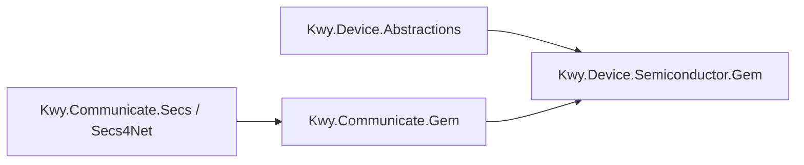

# Kwy.Device.Semiconductor.Gem

`Kwy.Device.Semiconductor.Gem` 是设备层到 GEM 层的可选桥接模块。

它负责把 `Kwy.Device.Abstractions` 中的整机状态、事件和报警转换为 GEM 的 `CEID / RPTID / VID / ALID` 上报，不把设备模型放进 `Kwy.Communicate.Gem`，也不让通信层反向依赖设备层。

## 引用关系



## 使用方式

```csharp
services.AddKwyDeviceCore();
services.AddSingleton<ISecsClient>(secsClient);
services.AddSingleton<GemRegistry>();
services.AddSingleton<IGemEquipment, GemEquipmentService>();

services.AddKwyDeviceGemBridge(options =>
{
    options.StateChangedCeid = 1000;
    options.EventIds["RecipeApplied"] = 2101;
    options.AlarmIds["PLC_ESTOP"] = 3001;
});
```

调用 `AddKwyDeviceGemBridge()` 后，设备层的 `IEquipmentEventSink` 会替换为 GEM 桥接实现。`IAlarmService`、`IAuditTrail`、`IEquipmentProcessController` 发布的事件会进入桥接层，并按配置映射为 GEM 上报。

## 映射规则

- 状态变化：默认上报 `StateChangedCeid`。
- 普通事件：优先使用 `options.EventIds` 显式映射；未配置时使用事件 Code 生成稳定 CEID。
- 报警：优先使用 `options.AlarmIds` 显式映射；未配置时使用事件 Code 生成稳定 ALID。
- VID/RPTID：桥接层会自动注册最近一次状态、事件、报警相关变量，便于 S6F11 报告携带上下文。

正式半导体项目建议把客户认可的 `CEID / RPTID / VID / ALID` 表显式写入配置，不依赖自动生成 ID。
