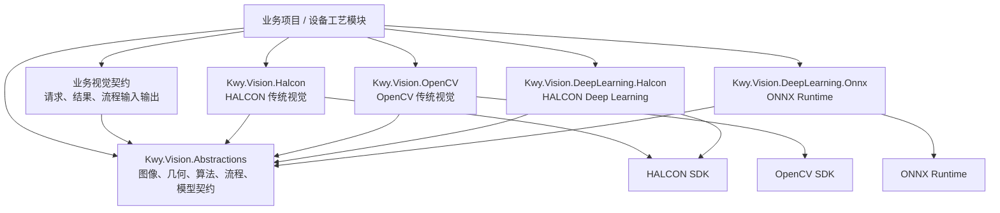
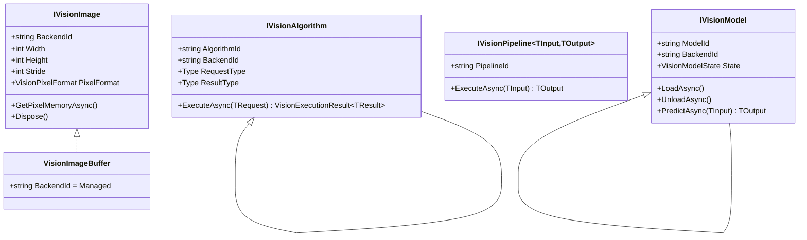
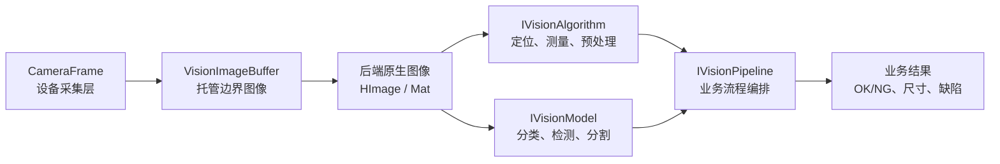
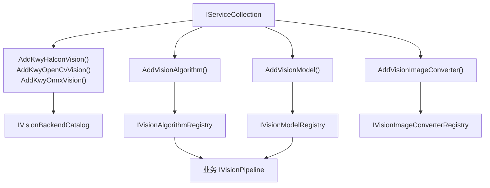
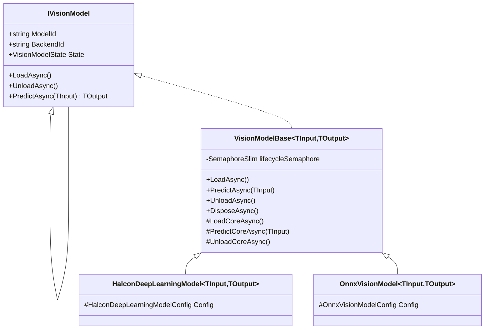
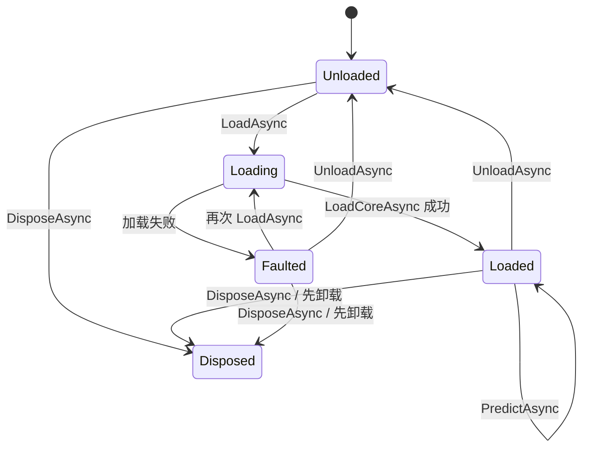

# Kwy 视觉模块架构与扩展指南

## 设计目标

Kwy 视觉模块需要同时支持传统视觉和深度学习，并允许 HALCON、OpenCV、HALCON Deep Learning、ONNX Runtime 等实现共存。

核心原则：

1. 公共层定义稳定的数据与能力，不尝试抽象厂商算子全集。
2. `HImage`、`HObject`、`Mat`、`InferenceSession`、Tensor 等原生对象只存在于实现项目内部。
3. 算法、流程和模型的输入输出保持强类型。
4. 传统视觉算法与深度学习模型使用不同的生命周期和接口。
5. HALCON DL 与 ONNX 配置分别保存在各自项目中。
6. 业务流程使用明确的输入输出模型，不使用 `Dictionary<string, object>` 传递步骤数据。
7. 原生图像只在模块边界转换，同一后端流程内部避免重复复制。

## 项目分层

```text
Kwy.Vision.Abstractions
  Images          图像、像素格式、图像转换能力
  Geometry        点、线、矩形、圆、区域、二维位姿
  Results         通用执行结果、匹配、测量、缺陷、叠加信息
  Algorithms      强类型传统视觉算法和算法注册表
  Pipeline        强类型业务视觉流程
  DeepLearning    模型生命周期和分类、检测、分割结果
  Runtime         后端标识和后端目录

Kwy.Vision.Halcon
  HALCON 传统视觉算法及原生图像适配

Kwy.Vision.OpenCV
  OpenCV 传统视觉算法及原生图像适配

Kwy.Vision.DeepLearning.Halcon
  HALCON Deep Learning 模型加载和推理

Kwy.Vision.DeepLearning.Onnx
  ONNX Runtime 模型加载和推理
```

`Algorithms` 目录与实现层保持同样的能力分组，但只定义强类型契约，不包含 HALCON、OpenCV 或业务语义：

```text
Algorithms
  Core            图像预处理、Blob、轮廓检测、读码等基础契约
  Measurement     卡尺、卡尺组、距离测量、几何关系、Metrology 等测量契约
  Fitting         直线、圆、轮廓拟合契约
  Matching        模板/形状匹配契约
  Calibration     平面标定、旋转中心、坐标补偿契约
  Infrastructure  算法接口和算法注册表
```

依赖方向：

```text
业务项目
  -> Kwy.Vision.Abstractions
  -> 选择一个或多个视觉实现项目

实现项目
  -> Kwy.Vision.Abstractions
  -> 对应厂商 SDK
```

`Kwy.Vision.Abstractions` 不引用 HALCON、OpenCV 或 ONNX Runtime。

## 程序集引用关系

视觉模块遵循单向依赖。所有实现项目只能依赖公共抽象，公共抽象不能反向引用实现项目。



图中的“业务视觉契约”不是强制要求的新框架项目。中大型设备建议在解决方案内增加自己的契约程序集，例如：

```text
Machine.Vision.Contracts
  ProductInspectionInput
  ProductInspectionResult
  LocateProductRequest
  LocateProductResult
```

这样厂商实现项目可以实现业务定义的请求与结果，而不会让 `Kwy.Vision.Abstractions` 逐渐包含某台设备独有的产品模型。

### 当前项目引用矩阵

| 项目 | 必须引用 | 厂商运行库 | 职责 |
| --- | --- | --- | --- |
| `Kwy.Vision.Abstractions` | `Microsoft.Extensions.DependencyInjection.Abstractions` | 无 | 定义稳定公共契约、注册表和基础生命周期。 |
| `Kwy.Vision.Halcon` | `Kwy.Vision.Abstractions` | `halcondotnet.dll`、`halcon.dll` | HALCON 原生图像适配、Blob 检测、形状模板仓库和形状匹配。 |
| `Kwy.Vision.OpenCV` | `Kwy.Vision.Abstractions` | 当前尚未加入 OpenCV 引用 | OpenCV 传统视觉扩展骨架。实现真实算法时在本项目安装 OpenCV 包。 |
| `Kwy.Vision.DeepLearning.Halcon` | `Kwy.Vision.Abstractions` | `halcondotnet.dll` | HALCON DL 配置与模型扩展基类；具体模型加载和推理仍由业务模型实现。 |
| `Kwy.Vision.DeepLearning.Onnx` | `Kwy.Vision.Abstractions` | 当前尚未加入 ONNX Runtime 引用 | ONNX 模型扩展骨架。实现真实推理时在本项目安装对应执行提供程序。 |
| `Kwy.Vision.Tests` | 上述五个项目 | 测试运行时依赖 | 验证图像所有权、注册表、后端选择和模型生命周期。 |

### 业务项目应该引用哪些程序集

只使用公共类型、由其他模块完成算法注册时：

```text
业务项目
  -> Kwy.Vision.Abstractions
```

使用 HALCON 传统视觉：

```text
业务项目
  -> Kwy.Vision.Abstractions
  -> Kwy.Vision.Halcon
```

使用 OpenCV 加 ONNX：

```text
业务项目
  -> Kwy.Vision.Abstractions
  -> Kwy.Vision.OpenCV
  -> Kwy.Vision.DeepLearning.Onnx
```

同时使用 HALCON 定位和 ONNX 缺陷检测时，可以同时引用两个实现项目。它们通过不同 `BackendId` 和 `ModelId` 共存，不存在后注册覆盖前注册的问题。

### 禁止的引用方向

以下依赖不允许出现：

```text
Kwy.Vision.Abstractions -> Kwy.Vision.Halcon
Kwy.Vision.Abstractions -> Kwy.Vision.OpenCV
Kwy.Vision.Abstractions -> Kwy.Device.Cameras.*
Kwy.Vision.Halcon       -> Kwy.Vision.OpenCV
Kwy.Vision.OpenCV       -> Kwy.Vision.Halcon
Kwy.Vision.DeepLearning.Onnx -> Kwy.Vision.DeepLearning.Halcon
```

如果两个后端之间需要转换图像，应通过公共 `IVisionImage`、`IVisionImageConverter` 和 `IVisionImageConverterRegistry` 在业务组合层协调，而不是让实现程序集彼此引用。

## 核心对象模型



### 三类“模型”不要混淆

视觉系统中“模型”这个词经常指向不同概念，Kwy 将其分开：

| 类型 | 示例 | 生命周期 | 所在层级 |
| --- | --- | --- | --- |
| 数据模型 | `VisionPoint`、`VisionDefect`、`LocateProductRequest` | 普通 CLR 对象 | 公共抽象或业务契约层。 |
| 传统视觉资源 | HALCON 形状模板、OpenCV 描述子、标定数据 | 通常需要加载和释放，但不是深度学习推理模型 | 传统视觉实现内部。 |
| 深度学习模型 | HALCON `.hdl`、ONNX `.onnx`、TensorRT Engine | `Load -> Predict -> Unload -> Dispose` | `Kwy.Vision.DeepLearning.*`。 |

不要为了名称统一，让传统模板匹配也实现 `IVisionModel<TInput,TOutput>`。传统视觉对外仍表现为 `IVisionAlgorithm<TRequest,TResult>`；模板句柄是算法实现内部资源。

## 各层对象关系



各层职责：

| 层级 | 输入 | 输出 | 不负责 |
| --- | --- | --- | --- |
| 相机设备层 | 触发信号、相机配置 | `CameraFrame` | 定位、测量、缺陷判定。 |
| 图像适配层 | `CameraFrame`、文件、其他后端图像 | `IVisionImage` | 产品业务判定。 |
| 算法层 | 强类型请求 | `VisionExecutionResult<TResult>` | 整机流程状态机。 |
| 深度学习层 | 图像或强类型张量输入 | 分类、检测、分割等结果 | 相机连接和硬件触发。 |
| 流程层 | 产品检测输入 | 产品检测结果 | 暴露后端 SDK 类型。 |
| 业务设备层 | 流程结果、工艺参数 | OK/NG、报警、数据上报 | 直接操作 `HImage`、`Mat` 或 Tensor。 |

## 运行时注册关系

DI 注册分为“后端声明”“算法实例”“模型实例”“图像转换器”四部分：



四个注册表的边界：

| 服务 | 管理内容 | 查找键 | 是否执行算法 |
| --- | --- | --- | --- |
| `IVisionBackendCatalog` | 已安装的视觉后端及其能力说明。 | `BackendId` | 否。 |
| `IVisionAlgorithmRegistry` | 传统视觉算法实例。 | `AlgorithmId + BackendId` | 返回强类型算法，由调用方执行。 |
| `IVisionModelRegistry` | 深度学习模型实例。 | 唯一 `ModelId` | 返回强类型模型，由调用方加载和推理。 |
| `IVisionImageConverterRegistry` | 图像后端转换器实例。 | `BackendId` | 否，只负责取得目标后端转换器。 |

`BackendCatalog` 只回答“当前应用安装了哪些后端”，不能用于取得具体算法。安装 HALCON 后端也不代表所有 HALCON 算法都会自动注册。
内置注册扩展方法是幂等的，重复调用同一个 `AddKwy*Vision()`、`AddVisionAlgorithm<T>()`、`AddVisionModel<T>()` 或 `AddVisionImageConverter<T>()` 不会产生重复注册。

### 单例与所有权

当前扩展方法将算法和模型注册为单例：

```text
应用 IServiceProvider
  owns IVisionAlgorithm instances
  owns IVisionModel instances
  owns IVisionAlgorithmRegistry
  owns IVisionModelRegistry
```

这适合模板句柄、推理 Session、GPU 内存等创建成本较高的资源。实现类必须满足：

- 不把单次请求的可变状态保存在共享字段中。
- SDK 不支持并发时，在实现内部串行执行或使用专用执行器。
- 模型释放时同步释放 Session、句柄、Tensor 缓冲区和 GPU 资源。
- 算法内部缓存模板时，模板的创建、替换和释放必须受控。

如果某算法确实需要按任务创建，应单独设计工厂，不要把整个视觉注册表改成瞬态生命周期。

### 推荐的业务流程构造函数

流程可以注入注册表，在初始化时解析并保存强类型算法与模型：

```csharp
public sealed class ProductInspectionPipeline
    : VisionPipelineBase<ProductInspectionInput, ProductInspectionResult>
{
    private readonly IVisionAlgorithm<LocateProductRequest, LocateProductResult> locator;
    private readonly IVisionModel<IVisionImage, ObjectDetectionResult> defectModel;

    public ProductInspectionPipeline(
        IVisionAlgorithmRegistry algorithms,
        IVisionModelRegistry models)
        : base("ProductInspection")
    {
        locator = algorithms.GetRequired<LocateProductRequest, LocateProductResult>(
            "LocateProduct",
            VisionBackendIds.Halcon);

        defectModel = models.GetRequired<IVisionImage, ObjectDetectionResult>(
            "SurfaceDefect.Onnx");
    }
}
```

流程后续只使用强类型字段，不在每个产品周期中重复进行字符串查找。

## 图像模型与所有权

公共图像接口为 `IVisionImage`：

```csharp
public interface IVisionImage : IDisposable, IAsyncDisposable
{
    string BackendId { get; }
    int Width { get; }
    int Height { get; }
    int Stride { get; }
    VisionPixelFormat PixelFormat { get; }

    ValueTask<ReadOnlyMemory<byte>> GetPixelMemoryAsync(
        CancellationToken cancellationToken = default);
}
```

`IVisionImage` 是有所有权的可释放对象，允许两种实现方式：

```text
VisionImageBuffer
  持有独立托管字节数组
  适用于相机帧、文件输入、跨后端传递和最终输出

HALCON / OpenCV 原生图像实现
  内部持有 HImage 或 Mat
  适用于同一后端内连续执行多个算子
```

公共项目提供的 `VisionImageBuffer` 始终复制输入数据，防止调用方释放或修改原始缓冲区后导致图像失效。

### 为什么不直接使用 byte[]

如果所有算法都只接收 `byte[]`，HALCON 流程会反复发生：

```text
HImage -> byte[] -> HImage -> byte[] -> HImage
```

使用 `IVisionImage` 后，实现项目可以包装原生图像：

```text
相机帧 -> HImage
  -> HALCON 定位
  -> HALCON 仿射变换
  -> HALCON 测量
  -> 最终结果或托管图像
```

中间步骤不需要回到托管像素。

### 后端转换

跨后端转换通过 `IVisionImageConverterRegistry` 获取目标后端转换器后完成：

```csharp
IVisionImageConverter converter = converters.GetRequired(VisionBackendIds.Halcon);
IVisionImage halconImage = await converter.ConvertAsync(sourceImage);
```

转换属于明确的模块边界操作，可能发生像素复制和格式转换，不应隐藏在每个算法内部。

## 几何约定

公共几何模型包括：

- `VisionPoint`
- `VisionLine`
- `VisionRectangle`
- `VisionRotatedRectangle`
- `VisionCircle`
- `VisionEllipse`
- `VisionArc`
- `VisionPolyline`
- `VisionContour`
- `VisionLineSet`
- `VisionPose2D`
- `VisionTransform2D`
- `VisionPoint3D`
- `VisionVector3D`
- `VisionQuaternion`
- `VisionPose3D`
- `VisionPlane`
- `IVisionRegion`

默认约定：

- 坐标单位为像素。
- 坐标原点位于图像左上角。
- X 向右增加，Y 向下增加。
- 所有角度属性明确命名为 `AngleRadians`，单位为弧度。
- 标定后的毫米坐标应由业务结果类型明确标注，不与像素坐标静默混用。

区域类型包括：

- `RectangleRegion`
- `RotatedRectangleRegion`
- `CircleRegion`
- `EllipseRegion`
- `PolygonRegion`
- `ContourRegion`
- `CompositeRegion`：一个外部区域减去一个或多个孔洞区域。

`VisionPolyline`、开放的 `VisionContour`、`VisionArc` 和 `VisionLineSet` 是几何描述，不是填充区域，因此不实现 `IVisionRegion`。闭合轮廓需要显式包装为 `ContourRegion` 后才能作为 ROI。

3D 位姿使用 `VisionQuaternion` 表示旋转，不使用未声明旋转顺序的欧拉角。`VisionPlane` 由平面上一点和法向量组成，`Normalize()` 可取得单位法向量平面，`SignedDistanceTo()` 可计算点到平面的有符号距离。

## 传统视觉算法

传统视觉算法使用强类型泛型接口：

```csharp
public interface IVisionAlgorithm<in TRequest, TResult>
{
    ValueTask<VisionExecutionResult<TResult>> ExecuteAsync(
        TRequest request,
        CancellationToken cancellationToken = default);
}
```

不要在公共层增加包含数百个方法的接口：

```csharp
// 不推荐
public interface IVisionService
{
    void Threshold(...);
    void FindCircle(...);
    void MatchShape(...);
    void MeasureEdge(...);
}
```

每类算法定义自己的请求和结果：

```csharp
public sealed record LocateProductRequest(
    IVisionImage Image,
    VisionRectangle SearchRegion,
    double MinimumScore);

public sealed record LocateProductResult(
    VisionPose2D Pose,
    double Score);
```

HALCON 实现：

```csharp
public sealed class HalconLocateProductAlgorithm
    : HalconVisionAlgorithm<LocateProductRequest, LocateProductResult>
{
    public HalconLocateProductAlgorithm()
        : base("LocateProduct")
    {
    }

    public override async ValueTask<VisionExecutionResult<LocateProductResult>> ExecuteAsync(
        LocateProductRequest request,
        CancellationToken cancellationToken = default)
    {
        // 在本项目内部将 IVisionImage 转换或复用为 HImage。
        // HImage 和形状模板句柄不能出现在公共请求或结果中。
        throw new NotImplementedException();
    }
}
```

OpenCV 可以为同一个请求和结果提供另一种实现：

```csharp
public sealed class OpenCvLocateProductAlgorithm
    : OpenCvVisionAlgorithm<LocateProductRequest, LocateProductResult>
{
    public OpenCvLocateProductAlgorithm()
        : base("LocateProduct")
    {
    }
}
```

## 算法注册与选择

注册后端和算法：

```csharp
services.AddKwyHalconVision();
services.AddKwyOpenCvVision();

services.AddVisionAlgorithm<HalconLocateProductAlgorithm>();
services.AddVisionAlgorithm<OpenCvLocateProductAlgorithm>();
```

同一算法只有一个实现时，可以不指定后端：

```csharp
var algorithm = registry.GetRequired<LocateProductRequest, LocateProductResult>(
    "LocateProduct");
```

同一算法存在多个实现时，必须明确指定后端：

```csharp
var halcon = registry.GetRequired<LocateProductRequest, LocateProductResult>(
    "LocateProduct",
    VisionBackendIds.Halcon);

var openCv = registry.GetRequired<LocateProductRequest, LocateProductResult>(
    "LocateProduct",
    VisionBackendIds.OpenCv);
```

未指定后端且存在多个实现时，注册表会抛出异常，不会静默选择最后注册的实现。

## 执行结果

算法返回 `VisionExecutionResult<TResult>`：

```csharp
VisionExecutionResult<LocateProductResult> result =
    await algorithm.ExecuteAsync(request, cancellationToken);

if (!result.Succeeded)
{
    logger.LogError(
        "视觉定位失败：{Code} {Message}",
        result.ErrorCode,
        result.ErrorMessage);
}
```

该包装提供：

- 是否成功。
- 强类型结果。
- 执行耗时。
- 错误码与错误说明。
- 可选诊断信息。

算法自己的结果模型仍保持独立，不需要继承统一的庞大基类。

## 业务视觉流程

视觉流程应围绕业务场景建模：

```csharp
public sealed record ProductInspectionInput(
    IVisionImage TopImage,
    string RecipeId);

public sealed record ProductInspectionResult(
    bool Passed,
    VisionPose2D ProductPose,
    IReadOnlyList<VisionMeasurement> Measurements,
    IReadOnlyList<VisionDefect> Defects);
```

流程实现：

```csharp
public sealed class ProductInspectionPipeline
    : VisionPipelineBase<ProductInspectionInput, ProductInspectionResult>
{
    public ProductInspectionPipeline(...)
        : base("ProductInspection")
    {
    }

    public override async ValueTask<ProductInspectionResult> ExecuteAsync(
        ProductInspectionInput input,
        CancellationToken cancellationToken = default)
    {
        // 1. 定位
        // 2. 坐标变换
        // 3. 尺寸测量
        // 4. 深度学习缺陷检测
        // 5. 综合判定
        throw new NotImplementedException();
    }
}
```

流程的中间对象是实现类的私有状态，不放入 `Dictionary<string, object>`。这样重命名字段、修改类型和调整步骤时都能得到编译器检查。

## 深度学习模型

深度学习模型使用独立接口：

```csharp
public interface IVisionModel<in TInput, TOutput>
{
    ValueTask LoadAsync(CancellationToken cancellationToken = default);
    ValueTask<TOutput> PredictAsync(
        TInput input,
        CancellationToken cancellationToken = default);
    ValueTask UnloadAsync(CancellationToken cancellationToken = default);
}
```

模型必须加载成功后才能推理。`VisionModelBase` 统一管理：

- 单飞加载。
- 加载、故障、卸载和释放状态。
- 未加载模型禁止推理。
- 异步卸载和资源释放。

标准预测结果包括：

- `ClassificationResult`
- `ObjectDetectionResult`
- `SegmentationResult`
- `AnomalyResult`

如果业务需要特殊输出，可以继续定义自己的强类型结果。

### 模型类型关系



公共 `VisionModelBase` 只管理生命周期和状态，不知道如何加载 HALCON 字典、ONNX Session 或 CUDA Engine。厂商基类保存自己的强类型配置，最终业务模型实现实际预处理、推理和后处理。

### 模型生命周期



生命周期约束：

1. `LoadAsync()` 单飞执行，重复加载已加载模型会直接返回。
2. `PredictAsync()` 只允许在 `Loaded` 状态调用。
3. 加载异常进入 `Faulted`，异常继续向调用方抛出。
4. `UnloadAsync()` 负责释放后端资源并回到 `Unloaded`。
5. `DisposeAsync()` 会先卸载模型，再进入不可恢复的 `Disposed`。

### 输入输出模型

模型输入不一定只能是 `IVisionImage`。预处理复杂时，应定义强类型输入：

```csharp
public sealed record DefectModelInput(
    IVisionImage Image,
    VisionRectangle ProductRegion,
    string ProductType);
```

模型输出也不必强行使用公共标准结果。如果模型同时返回检测框、分类等级和特征向量，可以定义业务结果：

```csharp
public sealed record DefectModelOutput(
    IReadOnlyList<ObjectDetection> Detections,
    string Grade,
    ReadOnlyMemory<float> FeatureVector);
```

关键要求是输入输出在编译期可检查，不能退回弱类型字典。

## 模型配置隔离

HALCON DL 配置：

```csharp
var config = new HalconDeepLearningModelConfig
{
    ModelId = "SurfaceDefect",
    ModelPath = "Models/surface_defect.hdl",
    Device = "gpu",
    BatchSize = 1
};
```

ONNX 配置：

```csharp
var config = new OnnxVisionModelConfig
{
    ModelId = "SurfaceDefect",
    ModelPath = "Models/surface_defect.onnx",
    ExecutionProvider = OnnxExecutionProvider.DirectML,
    IntraOpThreadCount = 2
};
```

两种配置不会被合并为带大量可空属性的公共模型。ONNX 新增执行提供程序或 HALCON 新增设备参数时，只修改对应实现项目。

## 模型注册与使用

```csharp
services.AddKwyOnnxVision();
services.AddVisionModel<SurfaceDefectOnnxModel>();
```

获取并推理：

```csharp
IVisionModelRegistry models = serviceProvider.GetRequiredService<IVisionModelRegistry>();

IVisionModel<IVisionImage, ObjectDetectionResult> model =
    models.GetRequired<IVisionImage, ObjectDetectionResult>("SurfaceDefect");

await model.LoadAsync(cancellationToken);
ObjectDetectionResult result = await model.PredictAsync(image, cancellationToken);
```

`ModelId` 必须唯一。需要同时加载 HALCON 和 ONNX 两个同用途模型时，应使用不同 ID，例如：

```text
SurfaceDefect.Halcon
SurfaceDefect.Onnx
```

## 与相机模块配合

相机模块与视觉算法模块保持独立：

```text
Kwy.Device.Cameras.*
  负责连接、触发和取得 CameraFrame

Kwy.Vision.*
  负责图像转换、视觉算法、流程和模型推理
```

业务层在模块边界将 `CameraFrame` 转换为 `VisionImageBuffer`：

```csharp
CameraFrame frame = await frameSource.WaitForNextFrameAsync(
    TimeSpan.FromSeconds(2),
    cancellationToken);

await using var image = new VisionImageBuffer(
    frame.PixelData,
    frame.Width,
    frame.Height,
    frame.Stride,
    ConvertPixelFormat(frame.PixelFormat),
    frame.Timestamp);
```

`Kwy.Vision.Abstractions` 不引用 `Kwy.Device.Abstractions`，防止视觉算法被设备采集层反向绑定。后续如果转换代码较多，可以建立独立的桥接项目，而不是让两个抽象项目互相引用。

## 新增传统视觉算法

1. 在业务契约项目或视觉抽象扩展中定义强类型请求和结果。
2. 在 HALCON 或 OpenCV 项目中继承对应算法基类。
3. 原生模型句柄、模板、区域和图像只保存在实现类内部。
4. 使用 `AddVisionAlgorithm<T>()` 注册。
5. 多实现并存时通过 `BackendId` 明确选择。

## 新增深度学习运行时

新增 TensorRT 等运行时时：

```text
Kwy.Vision.DeepLearning.TensorRT
  TensorRtVisionModelConfig
  TensorRtVisionModel<TInput, TOutput>
  AddKwyTensorRtVision()
```

实现 `VisionModelBase<TInput,TOutput>`，并保持 TensorRT Engine、CUDA Buffer 等类型只存在于该项目内部。

## 当前实现范围

当前版本已经完成：

- 公共图像、几何和结果模型。
- 强类型传统算法与算法注册表。
- 强类型业务流程基类。
- 深度学习模型生命周期与模型注册表。
- HALCON、OpenCV、HALCON DL 和 ONNX 后端注册。
- 四个实现项目的算法或模型扩展基类。
- 多后端冲突检测、模型状态和图像所有权测试。
- HALCON 托管图像与原生 `HImage` 转换。
- HALCON Blob 检测和形状匹配。
- HALCON 形状模板加载、替换、并发保护与释放。
- HALCON 卡尺边缘测量、二维平面仿射标定和亚像素轮廓检测。
- HALCON 直线/圆/轮廓拟合、几何距离测量、卡尺组测量、Blob 特征检测和图像预处理。

具体 HALCON 算子、OpenCV 算法、HALCON DL 模型及 ONNX Runtime 推理会按实际业务算法逐项实现，不应在尚未确定模型输入输出时建立空泛的万能算法接口。
