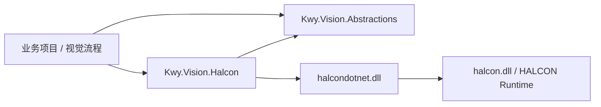

# Kwy.Vision.Halcon

`Kwy.Vision.Halcon` 是 Kwy 视觉框架的 HALCON 传统视觉实现层。

本项目允许在内部直接使用 `HImage`、`HRegion`、`HXLDCont`、`HTuple`、`HShapeModel` 和 HALCON 算子，但对业务层尽量只暴露 `Kwy.Vision.Abstractions` 中的请求、结果、几何和图像模型。

换句话说：

```text
业务层看 Kwy.Vision.Abstractions
实现层才看 HALCON
```

## 为什么 HALCON 代码难懂

HALCON 的思维方式和普通 C# 业务代码不一样。它更像一条图像处理流水线：

```text
图像 Image
  -> 区域 Region
  -> 轮廓 Contour / XLD
  -> 测量 Measure / Metrology
  -> 模型 Model
  -> 结果 Result
```

常见 HALCON 类型可以这样理解：

| 类型 | 理解方式 |
| --- | --- |
| `HImage` | 图像对象 |
| `HRegion` | 区域，常见于阈值分割、Blob 检测 |
| `HXLDCont` | 亚像素轮廓，例如边缘线、圆弧轮廓 |
| `HObject` | HALCON 通用对象基类 |
| `HTuple` | HALCON 的万能参数/数组容器 |
| `HShapeModel` | 形状模板匹配模型 |
| `HOperatorSet` | HALCON 原始静态算子集合 |

阅读本项目代码时，不建议一开始就从 `HOperatorSet` 或 `HTuple` 入手。更推荐先看抽象层的 Request / Result，再看 HALCON 实现类。

## 引用关系



`Kwy.Vision.Abstractions` 不引用 HALCON。  
`Kwy.Vision.Halcon` 引用 `Kwy.Vision.Abstractions` 和 HALCON SDK。  
业务代码应优先依赖抽象层，只有确实要写 HALCON 专用算法时才直接引用本项目。

## 模块职责

```text
Kwy.Vision.Abstractions
  定义通用视觉接口、请求、结果、几何模型和图像模型

Kwy.Vision.Halcon
  使用 HALCON 实现传统视觉算法

Kwy.Vision.OpenCV
  后续使用 OpenCV 实现同一批或另一批算法

Kwy.Vision.DeepLearning.*
  深度学习模型推理，不和传统视觉算子混在一起
```

## 当前目录

```text
Kwy.Vision.Halcon
  Algorithms
    Core          图像预处理、Blob、轮廓、扫码等基础能力
    Measurement   卡尺、几何关系、距离、Metrology 测量
    Fitting       直线、圆、轮廓拟合
    Matching      形状模板匹配
    Calibration   平面标定、旋转中心、坐标补偿
    Internal      HALCON 内部工具，不作为公共 API
  Images          HALCON 图像包装和转换
  Internal        Region 等内部转换工具
  Models          HALCON 模板模型仓库
```

## 算法阅读地图

### 图像与区域

| 算法 | 作用 | 典型 HALCON 概念 |
| --- | --- | --- |
| `HalconImagePreprocessAlgorithm` | 均值、中值、高斯、形态学、灰度增强、光照均衡等预处理 | `mean_image`、`median_image`、`gray_opening` |
| `HalconBlobInspectionAlgorithm` | 阈值分割、连通域、面积筛选、输出 Blob 几何结果 | `threshold`、`connection`、`select_shape` |
| `HalconBlobFeatureInspectionAlgorithm` | Blob 基础上输出圆度、周长、灰度统计、旋转矩形等特征 | `area_center`、`circularity`、`intensity` |
| `HalconContourDetectionAlgorithm` | 提取亚像素轮廓，并按长度和 ROI 筛选 | `edges_sub_pix`、`select_contours_xld` |

### 尺寸测量

| 算法 | 作用 | 典型 HALCON 概念 |
| --- | --- | --- |
| `HalconEdgeMeasurementAlgorithm` | 单个卡尺测边缘位置、幅值、边缘间距 | `measure_pos` |
| `HalconCaliperGroupMeasurementAlgorithm` | 多组卡尺批量测量 | `measure_pos` |
| `HalconLineMetrologyAlgorithm` | Metrology Model 拟合直线 | `create_metrology_model`、`add_metrology_object_line_measure` |
| `HalconCircleMetrologyAlgorithm` | Metrology Model 拟合圆 | `add_metrology_object_circle_measure` |
| `HalconDistanceMeasurementAlgorithm` | 点、线、圆之间距离计算 | 几何计算 |
| `HalconGeometryMeasurementAlgorithm` | 角度、交点、平行度、垂直度、同心度等 | 几何计算 |

### 拟合与匹配

| 算法 | 作用 | 典型 HALCON 概念 |
| --- | --- | --- |
| `HalconLineFittingAlgorithm` | 根据点列或轮廓拟合直线 | `fit_line_contour_xld` |
| `HalconCircleFittingAlgorithm` | 根据点列或轮廓拟合圆 | `fit_circle_contour_xld` |
| `HalconContourFittingAlgorithm` | 根据轮廓拟合旋转矩形等几何对象 | XLD 轮廓 |
| `HalconShapeMatchingAlgorithm` | 形状模板匹配 | `find_shape_model` |

### 标定与坐标

| 算法 | 作用 | 典型场景 |
| --- | --- | --- |
| `HalconPlanarCalibrationAlgorithm` | 像素坐标和世界坐标之间的二维映射 | 相机标定、尺寸换算 |
| `HalconRotationCenterAlgorithm` | 根据旋转点集计算旋转中心 | 转盘、旋转平台 |
| `HalconFixtureAlgorithm` | 坐标系补偿 | 产品定位后修正 ROI/测量位置 |

### 读码

| 算法 | 作用 |
| --- | --- |
| `HalconBarcodeReadAlgorithm` | 一维码读取 |
| `HalconDataCode2DReadAlgorithm` | QR / DataMatrix 等二维 Data Code 读取 |

## 典型算法流程

### Blob 检测

```text
输入图像
  -> ROI 裁剪
  -> 阈值分割
  -> 连通域分析
  -> 面积/宽高/圆度筛选
  -> 输出 Blob 中心、面积、外接矩形、特征
```

示意代码：

```csharp
var request = new BlobInspectionRequest(
    Image: image,
    MinimumGray: 128,
    MaximumGray: 255,
    MinimumArea: 100,
    MaximumArea: 20_000,
    SearchRegion: new RectangleRegion(
        new VisionRectangle(100, 80, 800, 600)),
    MaximumCount: 20);

VisionExecutionResult<BlobInspectionResult> result =
    await blobs.ExecuteAsync(request, cancellationToken);

if (result.Succeeded)
{
    foreach (VisionBlob blob in result.Value!.Blobs)
    {
        Console.WriteLine($"Area={blob.Area}, Center={blob.Center}");
    }
}
```

## Code Reading

`Kwy.Vision.Halcon` provides two code-reading algorithms:

| Algorithm | Request | Result | Typical symbols |
| --- | --- | --- | --- |
| `HalconBarcodeReadAlgorithm` | `BarcodeReadRequest` | `BarcodeReadResult` | `"auto"`, `"Code 128"`, `"EAN-13"` |
| `HalconDataCode2DReadAlgorithm` | `DataCode2DReadRequest` | `DataCode2DReadResult` | `"Data Matrix ECC 200"`, `"QR Code"` |

Both algorithms return decoded text through `VisionCodeRead.Text`.
When `EnableOverlay` is `true`, the detected code location is also returned through:

```text
VisionCodeRead.Contour
VisionExecutionResult.Overlays
```

This allows the WPF vision platform to draw the decoded barcode or data-code position directly on the image panel.

Common request parameters:

| Parameter | Meaning |
| --- | --- |
| `SearchRegion` | Optional ROI. The algorithm only searches inside this region. |
| `MaximumCount` | Maximum number of codes to return. |
| `TimeoutMilliseconds` | Optional HALCON reader timeout. Leave `null` to use HALCON defaults. |
| `MinimumContrast` | Optional minimum contrast. Leave `null` to use HALCON defaults. |
| `Polarity` | `Any`, `DarkOnLight`, or `LightOnDark`. |
| `EnableOverlay` | Whether to generate decoded-code overlay shapes. |

Example:

```csharp
var request = new DataCode2DReadRequest(
    Image: image,
    SymbolType: "Data Matrix ECC 200",
    SearchRegion: roi,
    MaximumCount: 1,
    TimeoutMilliseconds: 200,
    Polarity: CodePolarity.Any,
    EnableOverlay: true);

VisionExecutionResult<DataCode2DReadResult> result =
    await dataCodeReader.ExecuteAsync(request, cancellationToken);

if (result.Succeeded)
{
    foreach (VisionCodeRead code in result.Value!.Codes)
    {
        Console.WriteLine(code.Text);
    }
}
```

### 直线拟合

```text
输入点集或轮廓
  -> 转成 XLD 轮廓
  -> HALCON 拟合直线
  -> 输出直线、角度、残差
```

### 卡尺测量

```text
输入图像 + 卡尺区域
  -> 在卡尺方向上找边缘
  -> 得到边缘点
  -> 单卡尺输出边缘位置
  -> 多卡尺可进一步拟合线/圆
```

### 模板匹配

```text
加载形状模板
  -> 输入图像
  -> 查找模板位置
  -> 输出 Row / Column / Angle / Score
  -> 后续可用 Fixture 做坐标补偿
```

## 图像转换

业务层通常拿到的是 `IVisionImage`。算法内部需要 HALCON `HImage` 时，通过 `HalconVisionImageConverter` 获取。

```csharp
await using HalconImageLease lease = await converter.AcquireAsync(
    request.Image,
    cancellationToken);

HImage image = lease.Image;
```

转换规则：

```text
VisionImageBuffer
  -> 临时 HalconVisionImage
  -> HALCON 算法
  -> 算法结束后自动释放临时 HImage

HalconVisionImage
  -> 直接借用已有 HImage
  -> HALCON 算法
  -> 不释放调用方拥有的 HImage
```

当前支持的像素格式：

| 像素格式 | HALCON 类型 |
| --- | --- |
| `Mono8` | `byte` |
| `Mono16` | `uint2` |
| `Rgb24` | `rgb` 交错图像 |
| `Bgr24` | `bgr` 交错图像 |

## 注册

```csharp
services.AddKwyHalconVision();
```

该方法会注册：

```text
VisionBackendDescriptor(Halcon)
HalconVisionImageConverter
IVisionImageConverter
IVisionImageConverterRegistry
HalconShapeModelRepository
IHalconShapeModelRepository
HALCON 内置传统视觉算法
```

通过算法注册表获取算法：

```csharp
IVisionAlgorithmRegistry algorithms =
    serviceProvider.GetRequiredService<IVisionAlgorithmRegistry>();

var blobs = algorithms.GetRequired<BlobInspectionRequest, BlobInspectionResult>(
    HalconBlobInspectionAlgorithm.Id,
    VisionBackendIds.Halcon);
```

## 扩展一个 HALCON 算法

新增算法时建议遵循这个顺序：

1. 在 `Kwy.Vision.Abstractions` 定义 Request / Result。
2. 在 `Kwy.Vision.Halcon.Algorithms` 中新增 HALCON 实现。
3. 继承 `HalconVisionAlgorithm<TRequest, TResult>`。
4. 对外只返回抽象层模型，不返回 `HImage`、`HObject`、`HTuple`。
5. 在 `ServiceCollectionExtensions.AddKwyHalconVision()` 中注册算法。

示意：

```csharp
public sealed class HalconXxxAlgorithm
    : HalconVisionAlgorithm<XxxRequest, XxxResult>
{
    public const string Id = "Halcon.Xxx";

    public HalconXxxAlgorithm(...)
        : base(Id)
    {
    }

    public override async ValueTask<VisionExecutionResult<XxxResult>> ExecuteAsync(
        XxxRequest request,
        CancellationToken cancellationToken = default)
    {
        // 1. 获取 HImage
        // 2. 调用 HALCON 算子
        // 3. 转成 Kwy.Vision.Abstractions 的结果
    }
}
```

## 设计约定

- `Kwy.Vision.Halcon.Algorithms` 只放通用视觉底座算法。
- 不把锂电、3C、半导体等行业业务规则直接放进本项目。
- 行业算法应由视觉平台、流程节点、Recipe 或业务扩展模块组合实现。
- HALCON 原生对象只留在实现层内部。
- 公共请求、公共结果、业务流程接口不得暴露 `HImage`、`HTuple`、`HObject`。
- 可复用的 HALCON 内部工具放到 `Algorithms/Internal`，但不作为公共 API。

## 阅读建议

如果你刚开始看 HALCON，可以按这个顺序读：

1. `Kwy.Vision.Abstractions/Algorithms/Core/BlobInspectionContracts.cs`
2. `Kwy.Vision.Halcon/Algorithms/Core/HalconBlobInspectionAlgorithm.cs`
3. `Kwy.Vision.Halcon/Images/HalconVisionImageConverter.cs`
4. `Kwy.Vision.Halcon/Algorithms/Measurement/HalconEdgeMeasurementAlgorithm.cs`
5. `Kwy.Vision.Halcon/Algorithms/Matching/HalconShapeMatchingAlgorithm.cs`

先建立 `Image -> Region -> Contour -> Measure -> Result` 的概念，再去看具体算子会轻松很多。
