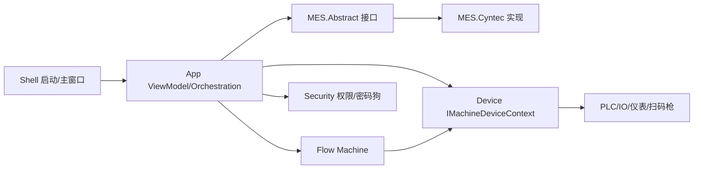

# KwyTemplate 接口设计与现场修改指南

本文档整理 `KwyTemplate.*` 项目中的主要接口：它们解决什么问题、由谁实现、谁来调用，以及上机验证发现行为不符合预期时，应该优先修改哪一层。

核心原则：

- `App` 负责界面、用户操作、流程编排，不直接写死某个 PLC 点位或某个仪表指令。
- `Flow` 负责机型业务。不同机型的 PLC 点位、工站、仪表组合、生产数据保存，都应该尽量落在 Machine 内部。
- `Device` 负责设备创建、配置持久化、启动连接、设备上下文访问。
- `MES.Abstract` 只定义客户 MES 能力边界，不依赖 Cyntec、麦捷等具体客户 DLL。
- `MES.Cyntec` 实现 Cyntec 客户协议、文件解析和 MES 日志。
- `Security` 负责用户、权限、密码狗抽象，不让业务层直接依赖密码狗 DLL。

## 总体调用关系

## Device 层接口

### IDeviceCatalog

位置：`KwyTemplate.Device.Profiles.IDeviceCatalog`

目的：描述某个机型需要哪些设备，以及这些设备的默认配置如何创建。

主要成员：

- `CatalogKey`：设备清单标识，建议使用 `nameof(Machine_xxx_DeviceCatalog)`，避免硬编码字符串记错。
- `IsDefault`：是否默认清单。真实客户机型一般由选择配置决定，不建议多个清单同时默认。
- `SelectionConfigId`：机型选择配置槽，默认共用 `DeviceSelection`。
- `CreateDeviceDefinitions()`：创建 PLC、IO、仪表、扫码枪等设备定义。

典型实现：

- `Machine_2_A_DeviceCatalog`
- `Machine_4_HAHH_DeviceCatalog`
- `Machine_Default_DeviceCatalog`

谁调用：

- `DeviceRegistryInitializer` 读取当前激活机型 Catalog，注册对应设备。
- `DeviceStartupConnector` 根据注册表统一连接设备。
- `SetViewModel` 通过设备定义和配置生成二级导航参数页。

现场不符合预期时怎么改：

- 新增机型：新增 `Machine_xxx_DeviceCatalog`，实现 `IDeviceCatalog`，再在 `DeviceModule` 或机型选择注册逻辑中注册。
- 设备没出现：先查 Catalog 是否被选中，再查 `CreateDeviceDefinitions()` 是否返回该设备。
- 配置 JSON 与代码默认不一致：已有 JSON 优先，代码默认只在文件不存在时生效。需要现场重置时删除对应 `Config/{CatalogKey}/{DeviceId}.json` 或提供迁移逻辑。

### IDeviceConfigProvider

位置：`KwyTemplate.Device.Profiles.IDeviceConfigProvider`

目的：统一管理设备配置 JSON。通过 `CatalogKey + DeviceId` 定位配置文件，避免每个设备自己读写文件。

主要成员：

- `GetOrCreate<TConfig>()`：有 JSON 则读取，没有则用 factory 创建默认配置并保存。
- `GetEntries()`：给 SetView、诊断等界面枚举当前配置。
- `SaveAsync()`：应用参数后统一保存。
- `ReloadAsync()`：从磁盘重新加载。

谁调用：

- 各 `Machine_xxx_DeviceCatalog` 创建设备定义时调用。
- `SetViewModel` 应用参数后保存。

现场不符合预期时怎么改：

- 参数界面显示旧值：检查是否已经存在旧 JSON。
- 希望某些参数启动后不显示到 HomeView：不要改 ConfigProvider，应该改 App 是否将本地配置应用到运行上下文。
- 配置文件损坏：可以在 ConfigProvider 增加读取失败备份和恢复默认配置的策略。

### IMachineDeviceContext

位置：`KwyTemplate.Device.Devices.IMachineDeviceContext`

目的：给 App 和 Flow 通过 `DeviceId` 获取设备实例。业务层不直接 new 设备。

主要成员：

- `Devices`：当前注册设备集合。
- `TryGet<TDevice>()`：可选获取。
- `GetRequired<TDevice>()`：必须存在，否则抛异常。
- `GetAll<TDevice>()`：按设备类型枚举。

谁调用：

- `MachineBase` 和各 Machine 获取 PLC、IO、仪表。
- `HomeViewModel`、`StationViewModel`、`ConnectViewModel` 做状态展示或软触发。

现场不符合预期时怎么改：

- 设备取不到：不要在 ViewModel 里 new，先查 DeviceId 是否与 Catalog 中一致。
- 同类多设备顺序不对：使用明确 DeviceId，不依赖 `GetAll<T>()` 的顺序。

### IDeviceRegistryInitializer

位置：`KwyTemplate.Device.Devices.IDeviceRegistryInitializer`

目的：程序启动时，把当前 Catalog 中的设备定义注册到设备注册表。

谁调用：

- Shell/App 启动流程。

现场不符合预期时怎么改：

- 某机型设备没注册：查当前激活 CatalogKey 与 `IDeviceCatalog.CatalogKey` 是否一致。
- 不要在 ViewModel 构造函数里补注册设备，这会导致职责分散。

### IDeviceStartupConnector

位置：`KwyTemplate.Device.Devices.IDeviceStartupConnector`

目的：程序启动时统一连接 Catalog 中的所有设备，关闭时统一释放。

谁调用：

- LoadView 启动流程 / App 启动编排。

现场不符合预期时怎么改：

- 某设备不该开机自动连接：当前设计是 Catalog 中设备全部启动连接。若后续确实需要差异，应在 DeviceDefinition 增加启动策略，而不是在 LoadView 写 if。
- 关闭程序 VS 仍运行：优先查该 Connector、MachineRuntimeOrchestrator、各 `IMachineRuntimeFeature.Dispose()`、串口/GPIB/IO/PLC 是否正确取消和释放。

### IBarcodeScannerDevice

位置：`KwyTemplate.Device.Scanners.IBarcodeScannerDevice`

目的：串口扫码枪设备抽象，继承 `IDevice` 和 `IConfigurableDevice`。

典型实现：

- `SerialBarcodeScannerDevice`

谁调用：

- Reel 扫码流程 `CyntecReelScanWorkflow`。
- 设备启动连接服务。

现场不符合预期时怎么改：

- 串口扫码枪无日志/未连接：查 Catalog 是否包含 Reel 扫码枪设备定义，查启动连接是否遍历到它。
- 扫码内容显示错误：业务处理在 `CyntecReelScanWorkflow`，不要改底层串口读取。

## Flow 层接口

### IMachine

位置：`KwyTemplate.Flow.Machines.IMachine`

目的：机型的最小运行抽象。

主要成员：

- `MachineId` / `MachineName`：机型标识和显示名。
- `IsRunning`：运行状态。
- `Stations`：工站模型集合。
- `StartAsync()`：开始生产，通常触发进站和机台运行逻辑。
- `StopAsync()`：停止生产。
- `PauseAsync()`：暂停，不等同于出站或清空数据。
- `ExecuteStationAsync()`：执行某个工站测试。

典型实现：

- `MachineBase`
- `Machine_2_A`
- `Machine_4_HAHH`

谁调用：

- `HomeViewModel` 的开始/停止/暂停。
- `StationViewModel` 的软触发。
- Orchestration 常驻功能。

现场不符合预期时怎么改：

- 某机型开始/停止流程不同：在具体 Machine 覆盖或扩展，不要在 HomeViewModel 写机型 if。
- 某点位轮询或工艺特殊：新增 Machine 能力接口或在 Machine 内实现，App 只调用抽象。

### IMachineResultProvider

位置：`KwyTemplate.Flow.Machines.IMachineResultProvider`

目的：给 HomeView DataGrid 提供动态列和行。

主要成员：

- `PartColumns`：测试结果表列。
- `PartRows`：测试结果表行。
- `TableChanged`：列/行结构或内容变化时通知 UI 刷新。

谁调用：

- `HomeViewModel` 初始化和刷新 DataGrid。

现场不符合预期时怎么改：

- DataGrid 多列、少列、列名错：改 Machine 的 `TestStations`、`OrderedTestNames` 或结果表生成逻辑。
- 不要在 HomeView.xaml 写死 DCR1/DCR2/LS/RS，否则新机型会坏。

### IStationOperationMachine

位置：`KwyTemplate.Flow.Machines.IStationOperationMachine`

目的：描述并执行某工站支持的操作，比如点检、校正。

主要成员：

- `GetStationOperations(station)`：返回该工站支持的操作。
- `ExecuteStationOperationAsync(station, operationCode)`：执行操作。

谁调用：

- `CompensateViewModel`
- `CorrectionViewModel`
- `StationViewModel`

现场不符合预期时怎么改：

- 一级导航是否显示校正：看 Machine 的 `TestStations[].Operations` 是否包含 `Calibration`。
- 某工站不应点检/校正：改该工站的 `Operations`，不要改导航界面。

### IStationDataDeal

位置：`KwyTemplate.Flow.DataDeals.IStationDataDeal`

目的：一次工站数据采集。实现类负责读仪表或 IO，并更新 `TestStationModel.TestValues/TestJudges`。

典型实现：

- `InstrumentMeasurementDataDeal`：单测试项仪表数据。
- `InstrumentMultiMeasurementDataDeal`：一个仪表返回多个测试项，例如 Ls/Rs。
- `StationIoResultDataDeal`：沿用设备/IO 判定结果。

谁调用：

- `MachineBase.ExecuteStationAsync()` 或具体 Machine 流程。

现场不符合预期时怎么改：

- 仪表原值/净值解析不对：改仪表实现或 `IStationInstrumentOperation.ReadMeasurementAsync()`。
- 判定方式从 IO 改 PC：改 `StationDataDeal` 组合和 `IMeasurementJudgeService`，不要在 UI 判定。
- 一个仪表要生成两列：用 `InstrumentMultiMeasurementDataDeal`，并让工站测试名来自仪表配置或 `OrderedTestNames`。

### IStationInstrumentOperation

位置：`KwyTemplate.Flow.DataDeals.IStationInstrumentOperation`

目的：把工站中的仪表抽象成可触发、可读取测量值的对象。

主要成员：

- `TestName`：测试项名称，对应结果列，如 `DCR1`、`Ls`、`Rs`。
- `TriggerAsync()`：软触发仪表。
- `ReadMeasurementAsync()`：读取原值和净值。

谁调用：

- `StationViewModel` 软触发测试。
- `CompensateViewModel` 自动/手动点检读取。
- `CorrectionViewModel` 校正流程。

现场不符合预期时怎么改：

- 软触发没有返回值：查具体仪表实现是否实现触发和读取。
- 需要显示原值与净值：由 `InstrumentMeasurementResult` 返回，不要让 ViewModel 自己解析串口/GPIB文本。

### IMeasurementJudgeService

位置：`KwyTemplate.Flow.DataDeals.IMeasurementJudgeService`

目的：PC 软件判定服务。根据 `TestStationModel.TestLimits` 判断测量值是否 OK。

谁调用：

- `InstrumentMeasurementDataDeal`
- `InstrumentMultiMeasurementDataDeal`
- 点检结果汇总逻辑

现场不符合预期时怎么改：

- 上下限相等边界是否 OK：改该服务，保持统一。
- MES 参数、本地设置、图表上下限不一致：保证参数写入后同步更新 `TestStationModel.TestLimits`。

### IMachineBraidSetupMachine

位置：`KwyTemplate.Flow.Machines.IMachineBraidSetupMachine`

目的：机型支持把编带参数写入 PLC。App 只传通用 `MesWorkOrderTapeSetup`，具体 DM 点位由 Machine 内部决定。

典型实现：

- `Machine_2_A`

谁调用：

- 工单导入成功后。
- MES 离线、本地 SetView 编带参数点击应用后。
- 参数对比上升沿时，Machine 内部重新下发。

现场不符合预期时怎么改：

- 编带参数写错点位：改具体 Machine 的点位映射。
- 新机型编带点位不同：实现该接口，不改 HomeViewModel。

### IMachineProductionCounterResetMachine

位置：`KwyTemplate.Flow.Machines.IMachineProductionCounterResetMachine`

目的：生产结束保存后，清 PLC 统计计数。

谁调用：

- `HomeViewModel` 停止并确认保存流程。

现场不符合预期时怎么改：

- 清零点位不是当前机型点位：改具体 Machine。
- 有些机型不需要清零：不实现该接口。

### IMachineProductionSummaryMachine

位置：`KwyTemplate.Flow.Machines.IMachineProductionSummaryMachine`

目的：生产结束时保存 `D:\MES\Summary\{WorkOrderNo}.txt` 汇总文件。

谁调用：

- `HomeViewModel` 在 TrackOut 成功后调用。

现场不符合预期时怎么改：

- Summary 字段顺序/字段名/默认值变化：改具体 Machine 的 `SaveProductionSummaryAsync()`。
- 不同客户 Summary 格式不同：不要塞进 HomeViewModel，应新增客户/机型实现。

### IMachinePlcStopSignalMachine

位置：`KwyTemplate.Flow.Machines.IMachinePlcStopSignalMachine`

目的：机型声明 PLC 哪些点位会触发停止/暂停/复位业务。

主要模型：

- `MachinePlcStopSignalKind.TapeMotorRelease`
- `MachinePlcStopSignalKind.CheckExpiredReelCompleted`
- `MachinePlcStopSignalKind.StandardExpiredReelCompleted`

谁调用：

- `MachinePlcStopSignalFeature` 常驻监听。

现场不符合预期时怎么改：

- 新增停止点位：扩展 enum 和具体 Machine 的读取/复位逻辑。
- 停止后是否清台纸：由 `MachinePlcStopSignal.ClearTablePaperCode` 控制。

### IIndustrialPcOnlineSignalMachine

位置：`KwyTemplate.Flow.Machines.IIndustrialPcOnlineSignalMachine`

目的：机型支持写入“工控机在线”信号。

谁调用：

- `MachineOnlineSignalFeature`

现场不符合预期时怎么改：

- 点位不存在或 X 输入点误写：从具体 Machine 移除实现或修正输出点位。
- 辅助写入失败不应让 PLC 整体变 Error：设备层应区分业务写入失败和连接断开。

### ICyntecReelScanMachine

位置：`KwyTemplate.Flow.Machines.ICyntecReelScanMachine`

目的：机型声明支持 Cyntec Reel 扫码，并暴露触发扫码的 IO 输入通道。

主要成员：

- `ReelScanInputChannel`

谁调用：

- `CyntecReelScanFeature` 监听 IO 上升沿。
- `CyntecReelScanWorkflow` 执行扫码枪读取和 MES `ScanReelAsync`。

现场不符合预期时怎么改：

- 某机型也需要 Reel 扫码：实现该接口。
- 输入点位变化：只改 Machine 的通道定义。

### IProductionRecordWriter

位置：`KwyTemplate.Flow.Services.IProductionRecordWriter`

目的：生产数据文件后台写入器。生产线程只入队，后台单写入器顺序落盘。

主要成员：

- `TryEnqueue()`：生产线程快速入队。
- `FlushAsync()`：等待队列落盘完成。
- `MoveAsync()`：把运行目录文件移动到 MES Output 目录，并归档旧文件。

谁调用：

- `Machine_2_A.ProcessTestRecordAsync()` 写每颗料数据。
- `HomeViewModel` 停止保存流程移动文件。

现场不符合预期时怎么改：

- 一颗料一条记录：Machine 负责组装字段，Writer 负责序号和落盘。
- 文件名规则变化：改 `ProductionRecordPathHelper.BuildFileName()`。
- 要批量写入策略：改 Writer，不改 Machine 生产主流程。

## App 层接口

### IProductionRuntimeContext / IProductionContext

位置：

- `KwyTemplate.Contracts.Services.IProductionRuntimeContext`
- `KwyTemplate.App.Runtime.IProductionContext`

目的：跨 ViewModel 和 Machine 流程共享当前生产上下文，例如工单、操作员、机台号、Reel 信息。

谁调用：

- `HomeViewModel` 写入扫描结果。
- `CompensateViewModel`、`StandardViewModel` 读取工单/设备号。
- `Machine_2_A` 保存生产数据时读取操作员和工单。

现场不符合预期时怎么改：

- 某字段只能来自指定扫码来源：在 HomeViewModel/Workflow 的入口处约束，不要让 TextBox TwoWay 可编辑。
- 生产数据 User/WorkOrder 错：优先查 Context 的赋值入口。

### IMachineRuntimeFeature

位置：`KwyTemplate.App.Orchestration.IMachineRuntimeFeature`

目的：App 层常驻业务功能插件。每个功能只关注一种运行期监听或连接逻辑。

典型实现：

- `MesConnectionFeature`：启动连接 MES。
- `MachineOnlineSignalFeature`：写工控机在线。
- `MachinePlcStopSignalFeature`：监听 PLC 停止信号。
- `CyntecReelScanFeature`：监听 Reel 扫码 IO。
- `CompensateScheduleMonitorFeature`：定时点检提醒。

谁调用：

- `MachineRuntimeOrchestrator` 统一启动/停止。

现场不符合预期时怎么改：

- 新增常驻监听：新增 Feature 实现接口并注册，不要塞进 HomeViewModel。
- 关闭程序不退出：检查 Feature 是否在 `Stop/Dispose` 取消循环、释放订阅。
- 轮询频率不对：改对应 Feature，避免全局改。

### ICyntecReelScanWorkflow

位置：`KwyTemplate.App.Orchestration.ICyntecReelScanWorkflow`

目的：Reel 扫码完整工作流：触发扫码枪、拿扫码内容、显示到 HomeView、调用 MES、更新 Reel 字段和状态颜色。

谁调用：

- `CyntecReelScanFeature` 的 IO 上升沿。
- HomeView 上扫码枪按钮。

现场不符合预期时怎么改：

- 按钮扫码和 IO 扫码业务不一致：改 Workflow，两个入口共用同一逻辑。
- BarcodeContent 只能来自串口扫码枪：保持入口在 Workflow，不允许盲扫 switch 写 BarcodeContent。

### IRawInputBarcodeReceiver

位置：`KwyTemplate.App.Input.IRawInputBarcodeReceiver`

目的：盲扫输入接收器，用 Windows RawInput 接收扫码枪键盘输入。

谁调用：

- `HomeView` 初始化 HWND 后调用 `Initialize()`。
- `HomeViewModel` 订阅 `BarcodeReceived` 做长度分流。

现场不符合预期时怎么改：

- 某长度扫码规则变化：改 HomeViewModel 的分流逻辑或抽出条码分类器。
- 串口扫码枪内容不要走这里：Reel 串口扫码走 `IBarcodeScannerDevice + ICyntecReelScanWorkflow`。

## MES 层接口

### IMesConnection

位置：`KwyTemplate.MES.Abstract.Services.IMesConnection`

目的：MES 在线/离线连接抽象。

谁实现：

- `MesCyntecService`

谁调用：

- `MesConnectionFeature` 启动连接。
- HomeView MES 按钮手动重连/断开。

现场不符合预期时怎么改：

- 不同客户连接方式不同：新增 `MES.CustomerX` 实现，不改 App。
- 连接失败但按钮状态不对：查 `StateChanged` 和 `MesConnectionStatus`。

### IMesWorkOrderService

目的：根据工单向 MES 查询参数，并返回通用 `MesWorkOrderSetup`。

Cyntec 当前行为：

- 调用 MES API。
- `ReturnCode == 0` 后读取 `D:\MES\Setup\{WorkOrderNo}.txt`。
- 解析 DCR 上下限、单位、Range、编带参数、台纸/上盖、点检间隔。

谁调用：

- HomeView 盲扫工单后。

现场不符合预期时怎么改：

- 文件字段变化：改 `CyntecMesFileParser`。
- MES 在线失败时允许本地设置：App 层进入本地参数应用路径，但不要伪造 MES 成功。
- 工单导入成功后图表/DataGrid不刷新：查 HomeViewModel 是否把 `MesWorkOrderSetup` 写入 Machine 的 `TestLimits` 并刷新 UI。

### IMesTrackService

目的：进站/出站。

主要成员：

- `TrackInAsync()`：开始生产进站。
- `TrackOutAsync()`：停止保存时出站。

谁调用：

- HomeView 开始/停止流程。

现场不符合预期时怎么改：

- 出站成功后才保存 Output/Summary：保持在 HomeViewModel 的停止保存流程中串联。
- 某客户进站参数不同：扩展 `MesTrackRequest.Context.Extra` 或客户实现内部映射，不要改通用接口。

### IMesStandardSampleService

目的：标准件/确认件查询和点检结果保存。

Cyntec 当前行为：

- `GetStandardSampleAsync()` 调 MES 成功后读取标准件参数文件。
- `SaveStandardSampleCheckAsync()` 保存点检结果并调用 MES。

谁调用：

- `StandardViewModel` 查询标准件/确认件。
- `CompensateViewModel` 点检完成后保存。

现场不符合预期时怎么改：

- 标准件 txt 多项解析不对：改 `CyntecMesFileParser.ParseStandardSampleSetup()`。
- 点检完成 PLC 点位没写：改 CompensateViewModel 或 Machine 点位能力，不改 MES 服务。

### IMesReelService

目的：Reel 扫码交互。

谁调用：

- `CyntecReelScanWorkflow`

现场不符合预期时怎么改：

- MES 返回字段对应 UI 错：改 Workflow 的字段映射。
- 客户 Reel API 参数不同：改客户 MES 实现，不改 Workflow 接口，除非通用模型确实缺字段。

### IMesMachineStatusService / IMesResultUploadService

目的：预留机台状态上传、测试结果上传。

当前状态：

- 用于后续麦捷等客户需求。
- 如果当前业务只走文件输出和 TrackOut，不必强行接入。

现场不符合预期时怎么改：

- 客户要求实时上传状态：在客户 MES 模块实现该接口，并由 Orchestration Feature 调用。
- 客户要求每颗料上传：不要塞进 Machine 生产主循环，建议用队列式上传服务，避免阻塞生产线程。

## Security 层接口

### ILoginService

目的：本地用户登录服务。

谁实现：

- `LocalLoginService`

谁调用：

- `LoginViewModel`
- 权限切换流程

现场不符合预期时怎么改：

- 数据库发布后不存在表：改 Security 数据库初始化/迁移，不要恢复硬编码兜底用户。
- 密码策略变化：改 PasswordHasher 或用户初始化数据。

### ICurrentUserService

目的：提供当前登录用户和角色状态。

谁调用：

- MainWindow 状态栏。
- 权限判断服务。
- MES 断开等敏感操作。

现场不符合预期时怎么改：

- 操作员/工程师颜色或显示不对：改 ViewModel 的状态映射或样式，不改登录服务。
- 权限不生效：查当前用户角色是否正确更新。

### IAuthenticationDialogService

目的：弹出登录/切换用户对话框。

谁调用：

- 权限拦截或登录按钮。

现场不符合预期时怎么改：

- 弹窗样式：改 View，不改接口。
- 登录成功后主界面状态不更新：查 CurrentUserService 事件。

### ISecurityKeyChecker

目的：密码狗存在性/授权检查抽象。

实现：

- `NullSecurityKeyChecker`：默认占位。
- `SuperDogSecurityKeyChecker`：真实金雅特/超级狗检查。

谁调用：

- MES 断开等需要密码狗授权的敏感功能。

现场不符合预期时怎么改：

- 某功能需要密码狗：业务只依赖 `ISecurityKeyChecker`。
- 换密码狗厂家：新增模块替换该接口，不改 HomeViewModel。

## Contracts 层接口

### IProductionOutputOptions

目的：给 Flow/App 提供 MES 输出目录，例如 Output、Summary。

实现：

- `CyntecMesOptions`

谁调用：

- `Machine_2_A.SaveProductionSummaryAsync()`
- 生产数据移动输出流程

现场不符合预期时怎么改：

- 路径从 `D:\MES\Summary` 改客户目录：改客户 Options。
- 不同客户目录结构不同：客户 MES 模块提供不同 Options 实现。

### IProductionRuntimeContext

目的：Contracts 层中的最小生产上下文，供非 App 层读取通用字段。

与 `IProductionContext` 的区别：

- `IProductionRuntimeContext` 更底层、更少字段。
- `IProductionContext` 是 App 内完整运行上下文。

## Shell 层相关接口

### IEquipmentEventSink

位置：当前实现为 `LogEquipmentEventSink`

目的：接收设备连接、参数写入、异常等事件，写入 LogView 和持久化日志。

现场不符合预期时怎么改：

- 设备读取频繁刷日志：不要在读取成功时发事件；只记录读取失败、写入失败、参数写入成功/失败等约定事件。
- 用户日志和开发者日志分离：用户日志走 LogView/`Logs/yyyyMMdd.txt`，开发者异常走 `Logs/Developer/yyyyMMdd.txt`。

## 上机验证不符合预期时的修改路径

### 1. UI 显示不符合预期

优先检查：

1. ViewModel 是否拿到了正确模型。
2. Machine 是否通过接口暴露了正确数据。
3. XAML 是否写死了机型字段。

修改建议：

- DataGrid 列/行不对：改 Machine 的 `TestStations/OrderedTestNames/PartColumns/PartRows`。
- 图表上下限不对：查 `TestStationModel.TestLimits` 是否被 MES 或本地参数正确写入。
- SetView 参数不可编辑规则不对：改 `SetViewModel.CanEditParameters`，不要改配置模型。

### 2. 工艺流程不符合预期

优先检查：

1. 这是机型差异，还是客户 MES 差异？
2. 是否已有能力接口可挂接？
3. 是否应该新增 `IMachineRuntimeFeature`？

修改建议：

- PLC 某点位上升沿触发业务：优先放在 Machine 能力接口 + Orchestration Feature。
- 某机型独有：放具体 Machine。
- 多机型共用：抽接口或基类模板方法。

### 3. MES 行为不符合预期

优先检查：

1. API 是否成功。
2. 本地 `D:\MES\...` 文件是否存在。
3. Parser 是否解析到通用模型。
4. App 是否把模型应用到 Machine/UI。

修改建议：

- API 参数不一致：改客户 MES 实现。
- txt 格式变化：改 Parser，并补单元测试。
- UI 没刷新：改 App 层应用结果，不要让 MES 服务直接操作 UI。

### 4. 硬件行为不符合预期

优先检查：

1. Catalog 是否注册了设备。
2. Config JSON 是否覆盖了代码默认值。
3. DeviceStartupConnector 是否连接成功。
4. Machine 是否取对 DeviceId。

修改建议：

- PLC 地址/协议不对：改设备 Config 或 HSL PLC 工厂。
- IO 卡异常：改设备层错误包装和连接策略。
- 仪表指令不对：改仪表实现，不要在 StationViewModel 拼指令。

### 5. 关闭程序资源泄漏

优先检查：

1. `IDeviceStartupConnector.DisposeAsync()` 是否断开设备。
2. `MachineRuntimeOrchestrator.Dispose()` 是否停止所有 Feature。
3. 每个 `IMachineRuntimeFeature.Stop/Dispose` 是否取消轮询。
4. 串口、GPIB、IO、PLC 是否释放 native 资源。

修改建议：

- 常驻循环必须持有 `CancellationTokenSource`。
- 离开界面才存在的监听放 ViewModel/Monitor，并在 `OnNavigatedFrom` 销毁。
- 程序生命周期级监听放 Orchestration Feature，并由 Orchestrator 统一释放。

## 新增功能时的落点建议

| 新功能 | 推荐位置 | 不推荐位置 |
| --- | --- | --- |
| 新机型设备清单 | `KwyTemplate.Device.Profiles.Machine_xxx_DeviceCatalog` | ViewModel |
| 新机型 PLC 点位/工站 | `KwyTemplate.Flow.Machines.Machine_xxx` | XAML |
| 新客户 MES | `KwyTemplate.MES.CustomerX` 实现 `MES.Abstract` 接口 | `MES.Abstract` 写客户逻辑 |
| 新常驻轮询 | `KwyTemplate.App.Orchestration.IMachineRuntimeFeature` | HomeViewModel 构造函数 |
| 新扫码规则 | 条码分类/Workflow/HomeViewModel 输入入口 | TextBox 绑定 |
| 新生产文件格式 | Machine 或客户输出服务 | `ProductionRecordWriter` 拼业务字段 |
| 新权限规则 | Security 服务/权限策略 | Button Click 里硬编码 |

## 当前已补单元测试的接口/功能

测试项目：`KwyTemplate.Tests`

已覆盖：

- `CyntecMesFileParser`：工单参数、标准件多项解析。
- `BraidOptions`：编带参数和 MES 模型互转。
- `StartupProgressService`：启动进度状态和事件。
- `ProductionRecordWriter`：队列写入、序号、移动、归档。
- `SuperDogSecurityKeyChecker`：不依赖 native DLL 的前置参数校验。

后续建议继续补：

- `CompensateScheduleMonitorFeature` 的时间窗口判断，可抽纯函数测试。
- `MeasurementJudgeService` 的上下限边界测试。
- `Machine_2_A.SaveProductionSummaryAsync` 可通过 Fake PLC 抽象测试。
- `CyntecReelScanWorkflow` 可通过 Fake 扫码枪/Fake MES 测试字段映射。
